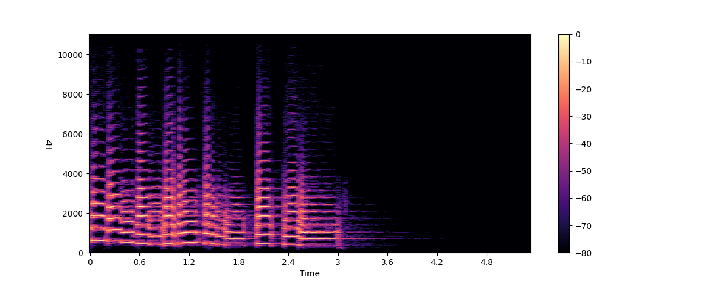

# 音频数据简介
从本质上讲，声波是一种连续信号，即在给定时间内包含无限多个信号值。这就给期待有限数组的数字设备带来了问题。要由数字设备进行处理、存储和传输，需要将连续声波转换为一系列离散值，即数字表示法。

如果您查看任何音频数据集，都会发现包含声音摘录（如文字叙述或音乐）的数字文件。您可能会遇到不同的文件格式，如 `.wav`（波形音频文件）、`.flac`（免费无损音频编解码器）和 `.mp3`（MPEG-1 Audio Layer 3）。这些格式的主要区别在于如何压缩音频信号的数字表示。

让我们来看看我们是如何从连续信号转换为数字信号的。模拟信号首先由麦克风捕捉，麦克风将声波转换为电信号。然后由模拟数字转换器将电信号数字化，通过采样得到数字信号。

## 采样和采样率

采样是以固定时间步长测量连续信号值的过程。采样波形是离散的，因为它以均匀的时间间隔包含有限数量的信号值。


采样率（也称采样频率）是指一秒钟内采样的次数，单位为赫兹（Hz）。作为参考，CD 级音频的采样率为 44,100 Hz，即每秒采样 44,100 次。相比之下，高分辨率音频的采样率为 192,000 Hz 或 192 kHz。训练语音模型时常用的采样率为 16,000 Hz 或 16 kHz。

采样率的选择主要决定了可以从信号中捕捉到的最高频率。这也被称为奈奎斯特极限，正好是采样率的一半。人类语音的可听频率低于 8 kHz，因此语音采样率为 16 kHz 就足够了。使用更高的采样率无法捕捉到更多信息，只会导致处理此类文件的计算成本增加。另一方面，过低的音频采样率会导致信息丢失。以 8 kHz 取样的语音听起来会发闷，因为在这种速率下无法捕捉到较高的频率。

在处理任何音频任务时，确保数据集中的所有音频示例具有相同的采样率非常重要。如果您计划使用自定义音频数据来微调预训练模型，那么数据的采样率应与模型预训练数据的采样率一致。采样率决定了连续音频样本之间的时间间隔，从而影响音频数据的时间分辨率。举个例子：采样率为 16,000 Hz 的 5 秒钟声音将表示为一系列 80,000 个值，而采样率为 8,000 Hz 的 5 秒钟声音将表示为一系列 40,000 个值。解决音频任务的Transformer模型将示例视为序列，并依靠注意力机制来学习音频或多模态表示。由于不同采样率下的音频示例序列不同，因此模型在不同采样率之间进行归纳具有挑战性。**重采样**是使采样率相匹配的过程，也是音频数据预处理的一部分。

## 振幅和比特深度
虽然采样率告诉您采样的频率，但每个采样的值到底是多少？

声音是由气压以人类可听到的频率变化产生的。声音的振幅描述的是任何给定瞬间的声压级，单位是分贝（dB）。我们将振幅视为响度。举个例子，正常说话的声音低于 60 分贝，而摇滚音乐会的声音可以达到 125 分贝左右，突破了人类听觉的极限。

在数字音频中，每个音频样本都记录了音频波在某个时间点的振幅。采样的比特深度决定了描述振幅值的精确度。比特深度越高，数字表示就越接近原始的连续声波。

最常见的音频比特深度是 16 位和 24 位。每种都是二进制项，代表振幅值从连续转换为离散时可量化的步数：16 位音频为 65,536 步，24 位音频则高达 16,777,216 步。由于量化涉及将连续值四舍五入为离散值，因此采样过程会产生噪音。比特深度越高，量化噪声就越小。实际上，16 位音频的量化噪声已经小到听不见，一般没有必要使用更高的比特深度。

您可能还会遇到 32 位音频。这种音频以浮点数值存储采样，而 16 位和 24 位音频则使用整数采样。32 位浮点数值的精度为 24 位，与 24 位音频的位深度相同。浮点音频样本预计在 [-1.0, 1.0] 范围内。由于机器学习模型自然是在浮点数据上工作的，因此必须先将音频转换为浮点格式，然后才能用于训练模型。我们将在下一节 "预处理 "中了解如何进行转换。

与连续音频信号一样，数字音频的振幅通常用分贝 (dB) 表示。由于人类的听觉是对数性质的--我们的耳朵对安静声音中的微小波动比响亮声音中的微小波动更加敏感--如果振幅以分贝为单位，声音的响度就更容易解释，而分贝也是对数。现实世界中的音频分贝从 0 dB 开始，代表人类能听到的最安静的声音，而较大的声音分贝值则较大。然而，对于数字音频信号来说，0 dB 是最响亮的振幅，而所有其他振幅都是负值。一个简单的经验法则是：每 -6 dB 的振幅减半，低于 -60 dB 的声音一般听不到，除非你把音量开得很大。

## 以波形显示音频
您可能见过将声音可视化为**波形**的方法，这种方法将采样值随时间的变化绘制成波形，并说明声音振幅的变化。这也被称为声音的时域表示法。

这种可视化方式有助于识别音频信号的具体特征，如单个声音事件的时间、信号的整体响度以及音频中存在的任何不规则现象或噪音。

要绘制音频信号的波形，我们可以使用名为 `librosa` 的 Python 库：

```cmd
pip install librosa
```

让我们以库中自带的 "小号 "声音为例：

```python
import librosa

array, sampling_rate = librosa.load(librosa.ex("trumpet"))
```

示例以音频时间序列（这里我们称之为数组）和采样率（sampling_rate）的元组形式加载。让我们使用 `librosa` 的 `waveshow()` 函数来看看这个声音的波形：

```python
import matplotlib.pyplot as plt
import librosa.display

plt.figure().set_figwidth(12)
librosa.display.waveshow(array, sr=sampling_rate)
```


它将信号的振幅绘制在 y 轴上，将时间绘制在 x 轴上。换句话说，每个点对应的是声音采样时的单个采样值。请注意，`librosa` 返回的音频值已经是浮点数值，而且振幅值确实在 [-1.0, 1.0] 范围内。

在聆听音频的同时将其可视化，是了解所处理数据的有用方法。你可以看到信号的形状，观察信号的模式，学会识别噪音或失真。如果以某种方式对数据进行预处理，如归一化、重采样或过滤，就可以直观地确认预处理步骤是否按预期进行。在训练模型后，您还可以直观地查看发生错误的样本（例如在音频分类任务中），以调试问题。

## 频谱
可视化音频数据的另一种方法是绘制音频信号的频谱，也称为频域表示。频谱是通过离散傅里叶变换或 DFT 计算得出的。它描述了构成信号的各个频率及其强度。

让我们使用 `numpy` 的 `rfft()` 函数进行 DFT 计算，绘制出同一小号声音的频谱图。虽然可以绘制整个声音的频谱，但查看一个小区域反而更有用。在这里，我们将对前 4096 个采样点进行 DFT，这大约是第一个音符的长度：

```python
import numpy as np

dft_input = array[:4096]

# calculate the DFT
window = np.hanning(len(dft_input))
windowed_input = dft_input * window
dft = np.fft.rfft(windowed_input)

# get the amplitude spectrum in decibels
amplitude = np.abs(dft)
amplitude_db = librosa.amplitude_to_db(amplitude, ref=np.max)

# get the frequency bins
frequency = librosa.fft_frequencies(sr=sampling_rate, n_fft=len(dft_input))

plt.figure().set_figwidth(12)
plt.plot(frequency, amplitude_db)
plt.xlabel("Frequency (Hz)")
plt.ylabel("Amplitude (dB)")
plt.xscale("log")
```


这表示该音频片段中各种频率成分的强度。频率值在 x 轴上，通常按对数标度绘制，而振幅则在 y 轴上。

我们绘制的频谱显示出几个峰值。这些峰值与正在演奏的音符的谐波相对应，谐波越高，声音越小。由于第一个峰值在 620 Hz 左右，因此这是一个降 E 音的频谱。

DFT 的输出是由实部和虚部组成的复数数组。用 `np.abs(dft)` 取其幅度，就能从频谱图中提取振幅信息。实分量和虚分量之间的夹角提供了所谓的相位频谱，但在机器学习应用中通常会忽略这一点。

您使用 `librosa.amplitude_too_db()` 将振幅值转换为分贝刻度，从而更容易看到频谱中更精细的细节。有时，人们会使用**功率谱**，它测量的是能量而不是振幅；这只是一个振幅值平方的频谱。

> :bulb: In practice, people use the term FFT interchangeably with DFT, as the FFT or Fast Fourier Transform is the only efficient way to calculate the DFT on a computer.

音频信号的频谱与波形包含完全相同的信息--它们只是观察相同数据（此处为小号声音的前 4096 个样本）的两种不同方式。波形显示的是音频信号随时间变化的振幅，而频谱显示的是固定时间点上各个频率的振幅。

## 时频谱
如果我们想了解音频信号中频率的变化情况，该怎么办？小号吹出几个音符，它们的频率各不相同。问题是，频谱只能显示特定时刻频率的凝固快照。解决的办法是进行多次 DFT，每次只覆盖一小段时间，然后将得到的频谱堆叠成频谱图。

频谱图绘制了音频信号随时间变化的频率内容。您可以在一张图上看到时间、频率和振幅。进行这种计算的算法是 STFT 或短时傅里叶变换。

频谱图是信息量最大的音频工具之一。例如，在处理音乐录音时，您可以看到各种乐器和声轨，以及它们对整体声音的影响。在语音中，您可以识别不同的元音，因为每个元音都有特定的频率。

让我们使用 `librosa` 的 `stft()` 和 `specshow()` 函数来绘制同一小号声音的时频谱：

```python
import numpy as np

D = librosa.stft(array)
S_db = librosa.amplitude_to_db(np.abs(D), ref=np.max)

plt.figure().set_figwidth(12)
librosa.display.specshow(S_db, x_axis="time", y_axis="hz")
plt.colorbar()
```



在这幅图中，X 轴代表的时间与波形图中的时间相同，但现在 Y 轴代表的是频率（单位：赫兹）。颜色的强度表示频率成分在每个时间点的振幅或功率，单位为分贝（dB）。

时频谱的制作方法是截取音频信号的短片段（通常持续几毫秒），计算每个片段的离散傅里叶变换，以获得其频谱。然后将得到的频谱在时间轴上堆叠在一起，形成频谱图。从上往下看，图像中的每个垂直切片都对应一个频谱。默认情况下，`librosa.stft()` 会将音频信号分割成 2048 个采样点的片段，从而在频率分辨率和时间分辨率之间取得良好的平衡。

由于时频谱和波形是同一数据的不同视图，因此可以使用反 STFT 将频谱图变回原始波形。不过，这除了需要振幅信息外，还需要相位信息。如果频谱图是由机器学习模型生成的，它通常只输出振幅。在这种情况下，我们可以使用相位重建算法（如经典的格里芬-林算法），或使用称为声码器的神经网络，从频谱图中重建波形。

时频谱不仅仅用于可视化。许多机器学习模型会将时频谱作为输入（而非波形），并生成时频谱作为输出。

既然我们已经知道了什么是时频谱以及时频谱的制作方法，那么让我们来看看它在语音处理中被广泛使用的一种变体：梅尔频谱图。

## 梅尔频谱图
梅尔频谱图是时频谱的一种变体，常用于语音处理和机器学习任务中。它与时频谱类似，显示音频信号随时间变化的频率内容，但频率轴不同。

在标准时频谱中，频率轴是线性的，以赫兹（Hz）为单位。然而，人类的听觉系统对低频的变化比对高频的变化更为敏感，而且这种敏感度会随着频率的增加而呈对数递减。旋律音阶是一种感知音阶，近似于人耳的非线性频率响应。

要创建梅尔频谱图，STFT 的使用方法与之前一样，将音频分成短小的片段，以获得一系列频谱。此外，每个频谱都要经过一组滤波器，即所谓的梅尔滤波器库，将频率转换为梅尔音阶。

让我们看看如何使用 `librosa` 的 `melspectrogram()` 函数绘制梅尔频谱图：

```python
S = librosa.feature.melspectrogram(y=array, sr=sampling_rate, n_mels=128, fmax=8000)
S_dB = librosa.power_to_db(S, ref=np.max)

plt.figure().set_figwidth(12)
librosa.display.specshow(S_dB, x_axis="time", y_axis="mel", sr=sampling_rate, fmax=8000)
plt.colorbar()
```


在上例中，`n_mels` 表示要生成的梅尔波段数。梅尔频带定义了一组频率范围，使用一组滤波器将频谱划分为有感知意义的成分，滤波器的形状和间距是模仿人耳对不同频率的反应方式而选择的。`n_mels` 的常用值为 40 或 80。`fmax` 表示我们关心的最高频率（单位为赫兹）。

与普通频谱图一样，通常的做法是用分贝来表示梅尔频率成分的强度。这通常被称为对数-梅尔频谱图，因为转换为分贝需要进行对数运算。上面的示例使用 `librosa.power_to_db()`，因为 `librosa.feature.melspectrogram()` 会创建功率频谱图。

> :bulb:  并非所有的旋律时频谱都是一样的！常用的梅尔音阶有两种（"htk "和 "slaney"），可以使用振幅时频谱代替功率时频谱。转换为对数梅尔频谱图并不总是计算真正的分贝，而可能只是取对数。因此，如果机器学习模型希望将梅尔频谱图作为输入，请仔细检查以确保计算方法相同。

创建梅尔频谱图是一种有损操作，因为它涉及到信号滤波。将梅尔频谱图转换回波形比普通频谱图更困难，因为它需要估算被丢弃的频率。这就是为什么需要使用机器学习模型（如 HiFiGAN 声码器）来从梅尔频谱图生成波形。

与标准时频谱相比，梅尔频谱图能捕捉到对人类感知更有意义的音频信号特征，因此在语音识别、扬声器识别和音乐流派分类等任务中很受欢迎。

既然你已经知道如何将音频数据实例可视化，那就试试看你最喜欢的声音是什么样的吧。:)
