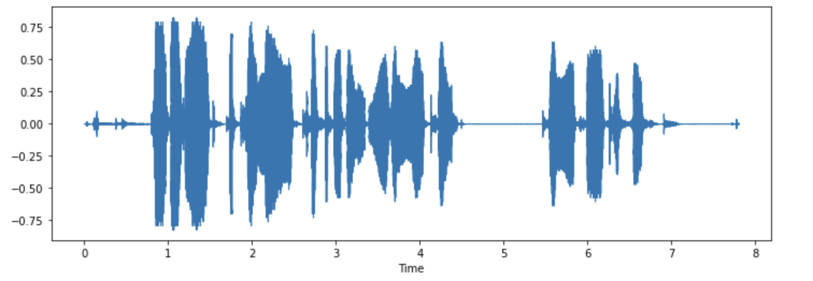

# 加载和探索音频数据集
在本课程中，我们将使用`Datasets`库来处理音频数据集。`Datasets`是一个开源库，用于下载和准备包括音频在内的各种模态的数据集。该库可轻松访问 Hugging Face Hub 上公开提供的无与伦比的机器学习数据集。此外，数据集还包括为音频数据集量身定制的多种功能，可简化研究人员和从业人员使用此类数据集的工作。

要开始使用音频数据集，请确保已安装Datasets库：

```cmd
pip install datasets[audio]
```

`Datasets`的一个重要特性是，只需使用 `load_dataset()` 函数编写一行 Python 代码，就能下载和准备一个数据集。

让我们加载并探索一个名为 `MINDS-14` 的音频数据集，它包含人们用多种语言和方言向电子银行系统提问的录音。

要加载 `MINDS-14` 数据集，我们需要复制 Hub 上的数据集标识符（PolyAI/minds14）并将其传递给 `load_dataset` 函数。我们还将指定只对数据的澳大利亚子集 (en-AU) 感兴趣，并将其限制为训练集：

```python
from datasets import load_dataset

minds = load_dataset("PolyAI/minds14", name="en-AU", split="train")
minds
```

输出：

```python
Dataset(
    {
        features: [
            "path",
            "audio",
            "transcription",
            "english_transcription",
            "intent_class",
            "lang_id",
        ],
        num_rows: 654,
    }
)
```

该数据集包含 654 个音频文件，每个文件都附有转录、英文翻译和标注，说明了个人查询的意图。音频列包含原始音频数据。让我们仔细看看其中一个例子：

```python
example = minds[0]
example
```

输出：

```python
{
    "path": "/root/.cache/huggingface/datasets/downloads/extracted/f14948e0e84be638dd7943ac36518a4cf3324e8b7aa331c5ab11541518e9368c/en-AU~PAY_BILL/response_4.wav",
    "audio": {
        "path": "/root/.cache/huggingface/datasets/downloads/extracted/f14948e0e84be638dd7943ac36518a4cf3324e8b7aa331c5ab11541518e9368c/en-AU~PAY_BILL/response_4.wav",
        "array": array(
            [0.0, 0.00024414, -0.00024414, ..., -0.00024414, 0.00024414, 0.0012207],
            dtype=float32,
        ),
        "sampling_rate": 8000,
    },
    "transcription": "I would like to pay my electricity bill using my card can you please assist",
    "english_transcription": "I would like to pay my electricity bill using my card can you please assist",
    "intent_class": 13,
    "lang_id": 2,
}
```

您可能会注意到，音频列包含几个功能。以下是它们的内容：

`path`：音频文件（此处为 *.wav）的路径。

`array`：数组： 解码后的音频数据，用一维 NumPy 数组表示。

`sampling_rate`：采样率。音频文件的采样率（本例中为 8000 Hz）。

`intent_class` 是录音的分类类别。要将这个数字转换成有意义的字符串，我们可以使用 `int2str()` 方法：

```python
id2label = minds.features["intent_class"].int2str
id2label(example["intent_class"])
```

输出：

```python
"pay_bill"
```

如果查看转录特征，就会发现音频文件确实记录了一个人询问有关支付账单的问题。

如果您打算在这个子数据集上训练音频分类器，您不一定需要所有的特征。例如，`lang_id` 将对所有示例具有相同的值，因此不会有用。`english_transcription` 可能会重复该子集中的转录，因此我们可以放心地将其删除。

使用`Datasets` 的 `remove_columns` 方法可以轻松删除不相关的特征：

```python
columns_to_remove = ["lang_id", "english_transcription"]
minds = minds.remove_columns(columns_to_remove)
minds
```

输出：

```python
Dataset({features: ["path", "audio", "transcription", "intent_class"], num_rows: 654})
```

现在我们已经加载并检查了数据集的原始内容，让我们来听几个例子！我们将使用 Gradio 的块和音频功能来解码数据集中的一些随机样本：

```python
import gradio as gr


def generate_audio():
    example = minds.shuffle()[0]
    audio = example["audio"]
    return (
        audio["sampling_rate"],
        audio["array"],
    ), id2label(example["intent_class"])


with gr.Blocks() as demo:
    with gr.Column():
        for _ in range(4):
            audio, label = generate_audio()
            output = gr.Audio(audio, label=label)

demo.launch(debug=True)
```

如果您愿意，还可以将一些示例可视化。让我们绘制第一个示例的波形图。

```python
import librosa
import matplotlib.pyplot as plt
import librosa.display

array = example["audio"]["array"]
sampling_rate = example["audio"]["sampling_rate"]

plt.figure().set_figwidth(12)
librosa.display.waveshow(array, sr=sampling_rate)
```



试试看！下载 `MINDS-14` 数据集的另一种方言或语言，聆听并可视化一些示例，以了解整个数据集的差异。您可以在[此处](https://huggingface.co/datasets/PolyAI/minds14)找到可用语言的完整列表。