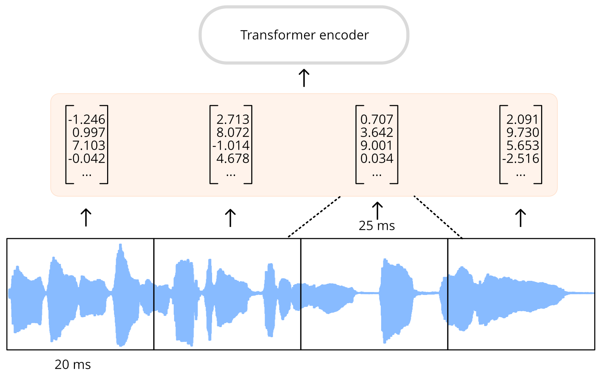

# CTC 架构
CTC 或 Connectionist Temporal Classification（连接时序分类）是一种用于自动语音识别的仅编码器Transformer模型技术。这类模型的例子有 **Wav2Vec2**、**HuBERT** 和 **M-CTC-T**。

纯编码器Transformer是最简单的Transformer，因为它只使用模型的编码器部分。编码器读取输入序列（音频波形），并将其映射为隐藏状态序列，也称为输出嵌入。

在 CTC 模型中，我们对隐藏状态序列应用额外的线性映射，以获得类标签预测。类标签是**字母表中的字符**（a、b、c......）。这样，我们就能用较小的分类头来预测目标语言中的任何单词，因为词汇量只需包含 26 个字符和一些特殊标记。


到目前为止，这与我们在 NLP 中使用 BERT 等模型所做的工作非常相似：纯编码器Transformer模型将文本token映射到编码器隐藏状态序列中，然后应用线性映射为每个隐藏状态预测一个类标签。

问题在于：在语音中，我们不知道音频输入和文本输出的**对齐**情况。我们知道语音说话的顺序与文本转录的顺序相同（即所谓的单调对齐），但我们不知道转录中的字符与音频如何对齐。这就是 CTC 算法的用武之地。

> :bulb: 在 NLP 模型中，词汇通常由数千个token组成，这些token不仅描述单个字符，还描述单词的部分内容，甚至完整的单词。不过，对于 CTC 来说，小词汇量最有效，我们通常会尽量将词汇量控制在 50 个字符以内。我们不关心字母的大小写，所以只用大写（或只用小写）就足够了。数字要拼写出来，例如，"20 "就变成了 "twenty"。除了字母，我们至少还需要一个单词分隔符（空格）和一个填充符。就像 NLP 模型一样，填充标记允许我们将多个示例合并在一批中，但它也是模型会无形预测的token。在英语中，保留"''"字符也很有用，毕竟""it's""和""its""的含义截然不同。

## 我的对齐方式呢？
自动语音识别（ASR）是将音频作为输入，然后将文本作为输出。对于如何预测文本，我们有几种选择：

+ 作为单个字符
+ 作为音位
+ 作为单词token

ASR 模型是在由（音频、文本）对组成的数据集上进行训练的，其中文本是音频文件的人工转录。一般来说，数据集不包含任何时序信息，即哪个词或音节出现在音频文件的哪个位置。由于在训练过程中我们不能依赖时序信息，因此我们不知道输入和输出序列应该如何对齐。

假设我们的输入是一个一秒钟的音频文件。在 **Wav2Vec2** 中，模型首先使用 CNN 特征编码器对音频输入进行下采样，以获得更短的隐藏状态序列，其中每 20 毫秒的音频有一个隐藏状态向量。对于一秒钟的音频，我们会将 50 个隐藏状态序列转发给变换器编码器。(从输入序列中提取的音频片段部分重叠，因此尽管每 20 毫秒发出一个隐藏状态向量，每个隐藏状态实际上代表 25 毫秒的音频）。

Transformer编码器为每个隐藏状态预测一个特征表示，这意味着我们从变换器接收到 50 个输出序列。每个输出的维度为 768。因此，本例中Transformer编码器的输出序列形状为 `(768, 50)`。由于每个预测覆盖的时间为 25 毫秒，比一个音位的持续时间还短，因此可以预测单个音位或字符，而不是整个单词。CTC 在词汇量较小的情况下效果最佳，因此我们将预测字符。



为了进行文本预测，我们使用一个线性层（"CTC 头"）将 768 维编码器输出中的每个输出映射到我们的字符标签。然后，模型会预测一个包含对数的 `(50, 32)` 张量，其中 32 是词汇表中的token数。由于我们会对序列中的每个特征进行一次预测，因此我们最终会对每秒音频中的 50 个字符进行预测。

但是，如果我们只是每 20 毫秒预测一个字符，我们的输出序列可能是这样的：

```
BRIIONSAWWSOMEETHINGCLOSETOPANICONHHISOPPONENT'SSFAACEWHENTHEMANNFINALLLYRREECOGGNNIIZEDHHISSERRRRORR ...
```

如果你仔细观察，就会发现它与英语有几分相似，但很多字符都是重复的。这是因为模型需要为输入序列中每 20 毫秒的音频输出一些内容，如果一个字符分布的时间超过 20 毫秒，那么它就会在输出中出现多次。我们没有办法避免这种情况，尤其是在训练过程中我们不知道文本的时间。CTC 是一种过滤重复序列的方法。

(实际上，预测序列中还包含很多填充token，当模型不确定声音代表什么或字符之间的空格时，就会使用这些填充token。为了清晰起见，我们从示例中删除了这些填充token。音频片段之间的部分重叠是输出结果中字符重复的另一个原因）。

## CTC 算法
CTC 算法的关键是使用一种特殊标记，通常称为**空白token**。这只是模型将预测的另一个token，也是词汇的一部分。在本例中，空白token显示为 _。这个特殊token是字符组之间的硬边界。

CTC 模型的完整输出可能如下所示：

```
B_R_II_O_N_||_S_AWW_|||||_S_OMEE_TH_ING_||_C_L_O_S_E||TO|_P_A_N_I_C_||_ON||HHI_S||_OP_P_O_N_EN_T_'SS||_F_AA_C_E||_W_H_EN||THE||M_A_NN_||||_F_I_N_AL_LL_Y||||_RREE_C_O_GG_NN_II_Z_ED|||HHISS|||_ER_RRR_ORR||||
```

| 标记是单词分隔符。在示例中，我们使用 | 代替空格，这样就更容易发现分隔符的位置，但其作用是一样的。

CTC 空白字符可以过滤掉重复的字符。例如，让我们看一下预测序列中的最后一个单词 `_ER_RRR_ORR`。如果没有 CTC 空白符，这个词看起来是这样的：

```
ERRRRORR
```

如果我们只是简单地删除重复的字符，这个词就会变成 `EROR`。这显然不是正确的拼写。但有了 CTC 空白token，我们就可以删除每组中的重复字符，这样，

```
_ER_RRR_ORR
```

就会变成 

```
_ER_R_OR
```

现在我们去掉 _ 空白token，得到最后一个单词：

```
ERROR
```

如果我们将这一逻辑应用于包括 | 在内的整个文本，并将尚存的 | 字符替换为空格，那么最终的 CTC 解码输出结果就是这样：

```
BRION SAW SOMETHING CLOSE TO PANIC ON HIS OPPONENT'S FACE WHEN THE MAN FINALLY RECOGNIZED HIS ERROR
```

概括地说，该模型会为输入波形中每 20 毫秒（部分重叠）的音频预测一个token（字符）。这就产生了大量的重复字符。有了 CTC 空白token，我们就可以在不破坏单词正确拼写的情况下轻松删除这些重复token。这是解决输出文本与输入音频对齐问题的一种非常简单方便的方法。

> :bulb: 在实际的 Wav2Vec2 模型中，CTC 空白标记与填充标记 \`\` 相同。例如，当当前 20 毫秒的音频中没有明确的字符可以预测时，模型就会预测出许多 \`\` 标记。使用与 CTC 空白相同的token进行填充可以简化解码算法，并有助于保持较小的词汇量。

将 CTC 添加到Transformer编码器模型中非常简单：编码器的输出序列进入线性层，该层将声学特征投射到词汇表中。该模型使用特殊的 CTC 损失进行训练。

CTC 的一个缺点是，它可能会输出**听起来**正确但拼写不正确的单词。毕竟，CTC 头只考虑单个字符，而不是完整的单词。提高音频转录质量的一种方法是使用外部语言模型。这种语言模型实质上是 CTC 输出之上的拼写检查器。

## Wav2Vec2、HuBERT、M-CTC-T......之间有什么区别？
所有基于Transformer的 CTC 型号都有一个非常相似的结构：它们使用Transformer编码器（但不使用解码器），并在其顶部安装一个 CTC 头。从结构上看，它们的相似之处多于不同之处。

Wav2Vec2 和 M-CTC-T 之间的一个区别是，前者使用原始音频波形，而后者使用视频图作为输入。此外，这两个模型的训练目的也不同。例如，M-CTC-T 是为多语言语音识别而训练的，因此其 CTC 头相对较大，除其他字母外，还包括汉字。

Wav2Vec2 和 HuBERT 采用完全相同的架构，但训练方式却截然不同。Wav2Vec2 采用了与 BERT 的屏蔽语言建模类似的预训练方法，即预测音频屏蔽部分的语音单元。HuBERT 在 BERT 的启发下更进一步，学习预测 "离散语音单元"（类似于文本句子中的token），从而可以使用成熟的 NLP 技术处理语音。

需要说明的是，这里强调的模型并不是唯一基于Transformer的 CTC 模型。还有很多其他的模型，但现在你知道它们都以类似的方式工作。