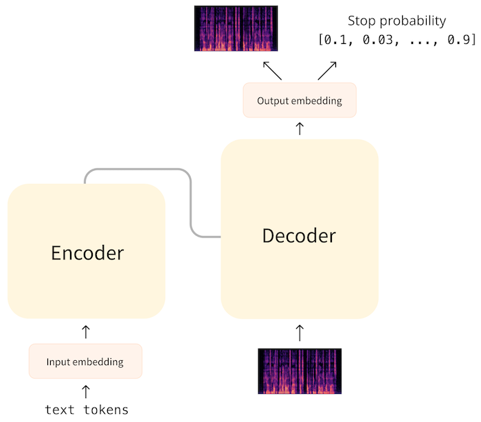

# Seq2Seq 架构
上一节讨论的 CTC 模型只使用了Transformer结构中的编码器部分。当我们同时添加解码器以创建一个编码器-解码器模型时，这被称为序列-序列模型或简称 Seq2seq。该模型将一种数据序列映射到另一种数据序列。

在纯编码器Transformer模型中，编码器会对输入序列中的每个元素进行预测。因此，输入和输出序列的长度总是相同的。在 CTC 模型（如 Wav2Vec2）中，输入波形首先被降采样，但每 20 毫秒的音频仍有一次预测。

而 seq2seq 模型则不存在这种一一对应关系，输入和输出序列的长度可能不同。这使得 seq2seq 模型不仅适用于文本摘要或不同语言间翻译等 NLP 任务，也适用于语音识别等音频任务。

解码器的结构与编码器的结构非常相似，两者都使用以自注意力为主要特征的相似layer。不过，解码器执行的任务与编码器不同。为了了解其工作原理，让我们来看看 seq2seq 模型如何进行自动语音识别。

## 自动语音识别
Whisper 的架构如下（图由 [OpenAI Whisper 博客](https://openai.com/research/whisper)提供）：

看起来应该很熟悉。左边是Transformer编码器。它将对数梅尔频谱图作为输入，并对该频谱图进行编码，形成编码器隐藏状态序列，从语音中提取重要特征。这个隐藏状态张量代表整个输入序列，并有效地编码输入语音的 "含义"。

> :bulb: 这些 seq2seq 模型通常使用频谱图作为输入。不过，seq2seq 模型也可以直接用于音频波形。

然后，编码器的输出通过一种称为交叉注意的机制进入Transformer解码器（如右图所示）。这种机制与自注意力机制类似，但在编码器输出上保持。从这时起，就不再需要编码器了。

解码器以**自回归**方式预测文本令牌序列，每次预测一个令牌，从初始序列开始，初始序列中只有一个 "开始 "令牌（在 Whisper 中为 `SOT`）。在接下来的每个时间步中，前一个输出序列作为新的输入序列反馈回解码器。这样，解码器每次发出一个新标记，输出序列稳步增长，直到预测出 "结束 "标记或达到最大时间步数。

虽然解码器的结构与编码器基本相同，但有两个很大的不同点：

在这种设计中，解码器扮演**语言模型**的角色，处理来自编码器的隐式表示并生成相应的文本转录。这是一种比 CTC 更强大的方法，即使 CTC 模型与外部语言模型相结合也是如此，因为 seq2seq 系统可以使用相同的训练数据和损失函数进行端到端训练，从而具有更大的灵活性和更优越的性能。

> :bulb: CTC 模型输出的是单个字符的序列，而 Whisper 预测的token则是完整的单词或单词的一部分。它使用 GPT-2 中的标记符，有 50k+ 个独特的token。因此，对于相同的转录，seq2seq 模型输出的序列比 CTC 模型短得多。

seq2seq ASR 模型的典型损失函数是交叉熵损失，因为模型的最后一层预测的是可能标记的概率分布。这通常[与集束搜索等技术相结合，以生成最终序列](https://huggingface.co/blog/how-to-generate)。语音识别的度量标准是 WER 或单词错误率，它衡量将预测文本转换为目标文本所需的替换、插入和删除次数，次数越少，得分越高。

## 文本到语音
您可能不会感到惊讶： 用于 TTS 的 seq2seq 模型的工作原理与上文所述基本相同，但输入和输出有所调换！Transformer编码器接收一系列文本token，并提取代表输入文本的一系列隐藏状态。Transformer解码器对编码器输出进行交叉注意，并预测频谱图。

> :bulb: 回想一下，频谱图是通过提取音频波形的连续时间片的频谱并将它们叠加在一起制成的。换句话说，频谱图是一个序列，其中的元素都是（log-mel）频谱，每个时间步长一个。

在 ASR 模型中，解码器是通过一个序列启动的，这个序列中只有一个特殊的 "开始 "token。对于 TTS 模型，我们可以使用长度为一的全为零的频谱图作为 "起始token "来启动解码。解码器根据这个初始频谱图和编码器隐藏状态表示的交叉注意，预测这个频谱图的下一个时间片，每次一个时间步，稳步增长频谱图。

但解码器如何知道何时停止？在 **SpeechT5** 模型中，解码器通过预测第二个序列来处理这个问题。其中包含当前时间步是最后一个时间步的概率。在推理时间生成音频时，如果该概率超过某个阈值（例如 0.5），解码器就会指示频谱图已经完成，生成循环应该结束。

解码完成后，我们会得到包含频谱图的输出序列，SpeechT5 会使用由多个卷积层组成的所谓**后网络**来完善频谱图。

在 TTS 模型的训练过程中，目标也是频谱图，损失为 L1 或 MSE。在推理时，我们希望将输出的频谱图转换为音频波形，这样我们就可以实际收听了。为此，我们使用了一个外部模型，即**声码器**。这个声码器不是 seq2seq 架构的一部分，而是单独训练的。

TTS 的难点在于它是一种一对多的映射。对于语音到文本，只有一个正确的输出文本与输入语音相对应，但对于文本到语音，输入文本可以映射到许多可能的语音。例如，不同的说话者可能会选择强调句子的不同部分。这使得 TTS 模型难以评估。正因为如此，L1 或 MSE 损失值实际上意义不大--有多种方法可以将相同的文本表示为频谱图。这就是为什么 TTS 模型通常由人类听者使用 MOS 或平均意见分进行评估的原因。

## 结论
seq2seq 方法比纯编码器模型更强大。通过将输入序列的编码与输出序列的解码分开，音频和文本的对齐问题就不那么严重了。

不过，编码器-解码器模型的速度也较慢，因为解码过程是一步一步进行的，而不是一次性完成。序列越长，预测速度就越慢。自回归模型也会在重复或跳字时卡住。集束搜索等技术有助于提高预测质量，但也会进一步减慢解码速度。