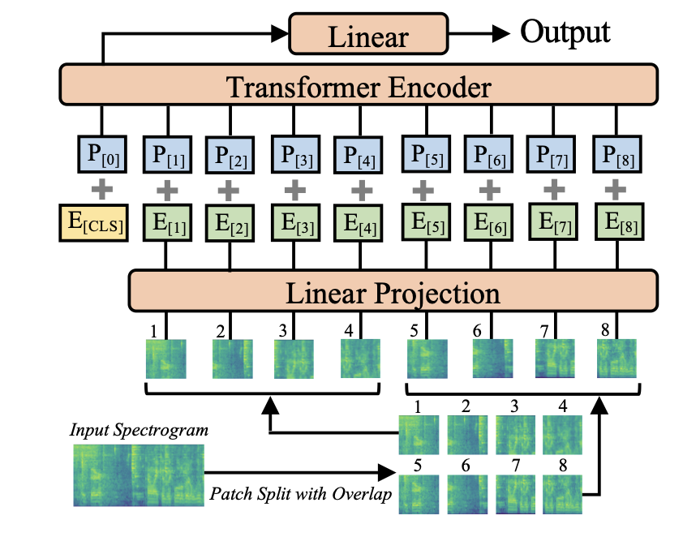

# 音频分类架构
音频分类的目标是预测音频输入的类别标签。模型可以预测涵盖整个输入序列的单一类别标签，也可以预测每帧音频的标签，通常是每 20 毫秒输入音频的标签，在这种情况下，模型的输出是类别标签概率序列。前者的一个例子是检测是哪只鸟在发出特定的声音；后者的一个例子是说话人日志，即模型预测在任何特定时刻说话的是哪位说话者。

## 使用频谱图进行分类
进行音频分类最简单的方法之一就是将其视为图像分类问题！

回想一下，频谱图是一个二维形状（频率、序列长度）张量。在[音频数据](chapter1/introduction_to_audio_data.md)一章中，我们将这些频谱图绘制成图像。你猜怎么着？我们完全可以将频谱图视为图像，然后将其传入普通的 CNN 分类器模型（如 ResNet），并获得非常好的预测结果。更妙的是，我们可以使用 ViT 等图像Transformer模型。

这就是**音频频谱Transformer**(Audio Spectrogram Transformer)的作用。它使用 ViT 或视觉转换器模型，将频谱图作为输入，而不是普通图像。得益于Transformer的自注意力层，该模型比 CNN 更能捕捉全局上下文。

与 ViT 一样，AST 模型将音频频谱图分割成一系列部分重叠的 16×16 像素图像片段。然后，这一串图像片段被投射到一串图像embedding中，这些图像embedding会像往常一样作为输入提供给Transformer编码器。AST 是一个仅有编码器的变换器模型，因此输出是一个隐藏状态序列，每个 16×16 输入patch对应一个隐藏状态。在此之上是一个简单的分类层，采用 sigmoid 激活将隐藏状态映射为分类概率。

图片来自论文 [AST: Audio Spectrogram Transformer](https://arxiv.org/pdf/2104.01778.pdf)

> :bulb: 尽管我们在此假定频谱图与图像相同，但两者还是有重要区别。例如，上下移动图像内容一般不会改变图像内容的含义。然而，上下移动频谱图会改变声音的频率，完全改变声音的特征。图像在平移时是不变的，但频谱图却不是。将频谱图当作图像处理在实践中效果很好，但请记住，它们实际上并不是一回事。

## 任何Transformer都可以是分类器
在前面的章节中，您已经看到 CTC 是一种使用纯编码器变换器进行自动语音识别的高效技术。这种 CTC 模型已经是分类器，可以从标记符号词汇表中预测类标签的概率。我们可以将 CTC 模型转化为通用的音频分类器，方法是改变标签，并用常规的交叉熵损失函数而不是特殊的 CTC 损失函数进行训练。

例如，HF Transformers 有一个 `Wav2Vec2ForCTC` 模型，但也有 `Wav2Vec2ForSequenceClassification` 和 `Wav2Vec2ForAudioFrameClassification`。这些模型架构的唯一区别在于分类层的大小和使用的损失函数。

事实上，通过在隐藏状态序列上添加一个分类层，任何纯编码器音频Transformer模型都可以变成音频分类器。(分类器通常不需要Transformer解码器）。

为了预测整个序列的单一分类得分（`Wav2Vec2ForSequenceClassification`），模型会取隐藏状态的平均值，并将其输入分类层。输出结果是一个单一的概率分布。

要对每个音频帧进行单独分类（`Wav2Vec2ForAudioFrameClassification`），分类器将在隐藏状态序列上运行，因此分类器的输出也是一个序列。