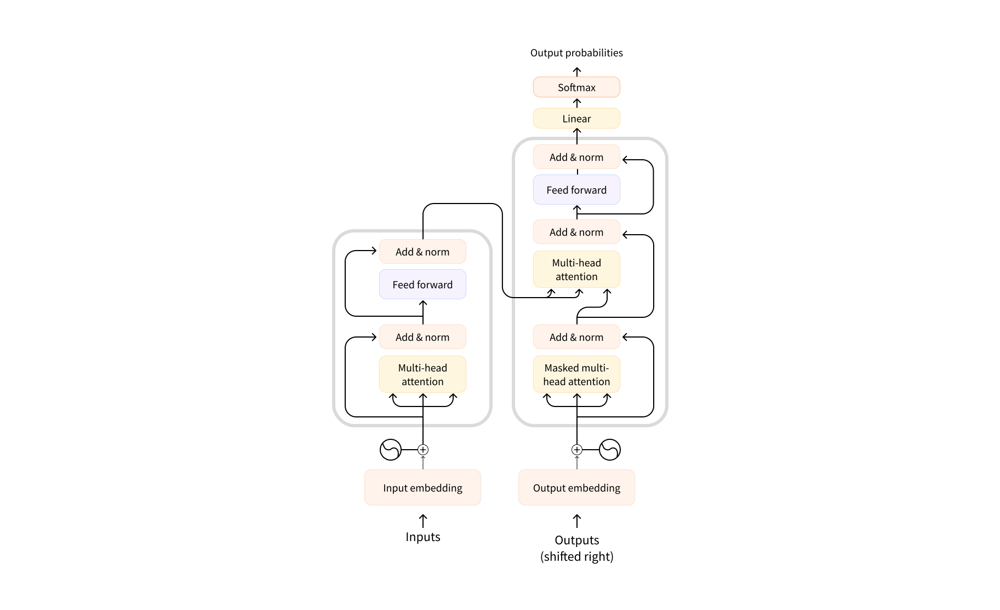
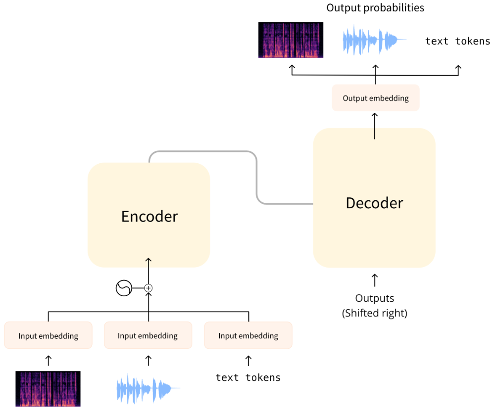
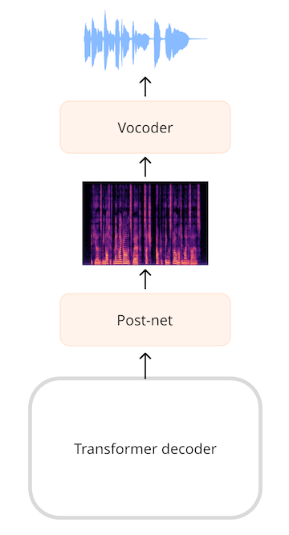

# 第 3 单元 音频Transformer架构
在本课程中，我们将主要讨论Transformer模型及其如何应用于音频任务。虽然您不需要了解这些模型的内部细节，但了解使它们发挥作用的主要概念还是很有帮助的，因此这里将为您做一个快速复习。

## Transformer是如何工作的？

最初的Transformer模型设计用于将书面文本从一种语言翻译成另一种语言。其架构如下

左边是**编码器**，右边是**解码器**。

+ 编码器接收输入（本例中为文本token序列）并建立其表示（特征）。模型的这一部分经过训练，可以从输入中获取理解。
+ 解码器使用编码器的表示（特征）和其他输入（先前预测的token）生成目标序列。模型的这一部分经过训练后生成输出。在最初的设计中，输出序列由文本token组成。

还有一些基于Transformer的模型只使用编码器部分（适用于需要理解输入的任务，如分类），或只使用解码器部分（适用于任务，如文本生成）。仅编码器模型的一个例子是 BERT；仅解码器模型的一个例子是 GPT2。

Transformer模型的一个主要特点是，它们由称为注意层的特殊层构建而成。这些层告诉模型在计算特征表示时要特别注意输入序列中的某些元素，而忽略其他元素。

## 使用音频Transformer
我们将在本课程中介绍的音频模型通常具有如上图所示的标准Transformer架构，只是在输入或输出端稍作修改，以允许使用音频数据而非文本数据。由于所有这些模型本质上都是Transformer，因此它们的大部分架构都是相同的，主要区别在于如何训练和使用。

对于音频任务，输入和/或输出序列可能是音频而不是文本：

+ 自动语音识别（ASR）： 输入是语音，输出是文本。

+ 语音合成 (TTS)： 输入是文本，输出是语音。

+ 音频分类： 输入是音频，输出是分类概率--序列中每个元素的分类概率或整个序列的单一分类概率。

+ 语音转换或语音增强： 输入和输出都是音频。

有几种不同的方法来处理音频，以便与Transformer一起使用。主要的考虑因素是，是使用原始形式的音频（波形），还是将其处理为时频谱。

## 模型输入
音频模型的输入可以是文本或声音。我们的目标是将输入转换为可由Transformer架构处理的嵌入向量。

### 文本输入
文本到语音模型将文本作为输入。其工作原理与原始转换器或任何其他 NLP 模型相同： 首先对输入文本进行tokenize处理，生成文本标记token。该序列将通过输入嵌入层发送，将标记转换为 512 维向量。然后，这些嵌入向量被传送到Transformer编码器中。

### 波形输入
自动语音识别模型将音频作为输入。要将变压器用于 ASR，我们首先需要以某种方式将音频转换为嵌入向量序列。

**Wav2Vec2** 和 **HuBERT** 等模型直接将音频波形作为模型的输入。正如我们在[音频数据](../chapter1/what_you'll_learn.md)一章中所看到的，波形是浮点数的一维序列，其中每个数字代表特定时间的采样振幅。首先将原始波形归一化为零均值和单位方差，这有助于将不同音量（振幅）的音频样本标准化。

经过归一化处理后，音频采样序列会通过一个小型卷积神经网络（即特征编码器）转化为嵌入信息。该网络中的每个卷积层都会处理输入序列，对音频进行子采样以减少序列长度，直到最后的卷积层输出一个 512 维的向量，其中包含每 25 毫秒音频的嵌入。一旦输入序列被转换成这样的嵌入序列，Transformer就会像往常一样处理数据。

### 时频谱输入
使用原始波形作为输入的一个缺点是，它们的序列长度往往较长。例如，采样率为 16 kHz 的 30 秒音频输入长度为 30 * 16000 = 480000。较长的序列长度需要在变压器模型中进行更多的计算，因此内存使用率也更高。

因此，原始音频波形通常不是表示音频输入的最有效形式。通过使用时频谱，我们可以获得相同数量的信息，但形式更为压缩。

**Whisper** 等模型首先将波形转换为对数梅尔频谱图。Whisper 总是将音频分成 30 秒的片段，每个片段的对数梅尔频谱图形状为 (80, 3000)，其中 80 是梅尔分段数，3000 是序列长度。通过转换成对数梅尔频谱图，我们减少了输入数据量，但更重要的是，这个序列比原始波形要短得多。然后，对数梅尔频谱图会被一个小型 CNN 处理成一个嵌入序列，像往常一样进入Transformer。

在这两种情况下，无论是波形输入还是频谱图输入，Transformer前都有一个小型网络将输入转换为嵌入式数据，然后Transformer接手处理。

## 模型输出

Transformer架构输出一系列隐藏状态向量，也称为输出嵌入。我们的目标是将这些向量转换成文本或音频输出。

### 文本输出
自动语音识别模型的目标是预测文本标记序列。具体做法是在Transformer的输出上添加语言建模头（通常是单线性层）和 `softmax`。这样就能预测词汇表中文本token的概率。

### 时频谱输出
对于生成音频的模型，例如文本到语音（TTS）模型，我们必须添加可以生成音频序列的层。通常的做法是先生成时频谱，然后使用额外的神经网络来生成音频序列。

> :bulb: 如果将已有的波形应用短时傅里叶变换（STFT），就有可能进行反向运算，即 ISTFT，重新获得原始波形。这是因为 STFT 创建的频谱图包含振幅和相位信息，而重建波形需要这两种信息。然而，以时频谱形式生成输出的音频模型通常只能预测振幅信息，而不能预测相位信息。要将时频谱转化为波形，我们必须以某种方式估算相位信息。这就是声码器的作用。

### 波形输出
作为中间步骤，模型也可以直接输出波形而不是时频谱，但我们目前还没有Hugging Face `Transformers` 中的任何模型可以做到这一点。

## 结论
总结：大多数音频Transformer模型的相似之处多于不同之处--它们都建立在相同的Transformer架构和注意力层上，不过有些模型只使用Transformer的编码器部分，而有些则同时使用编码器和解码器。

您还看到了如何将音频数据输入和输出Transformer模型。为了执行 ASR、TTS 等不同的音频任务，我们可以简单地交换将输入预处理为嵌入式的层，以及将预测的嵌入式后处理为输出的层，而Transformer主干保持不变。

接下来，让我们看看训练这些模型进行自动语音识别的几种不同方法。