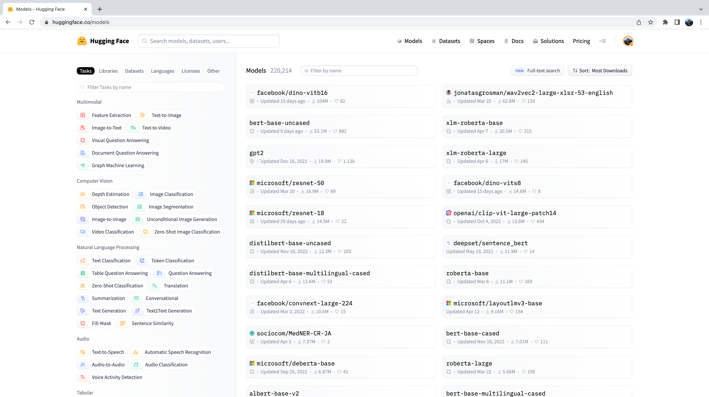
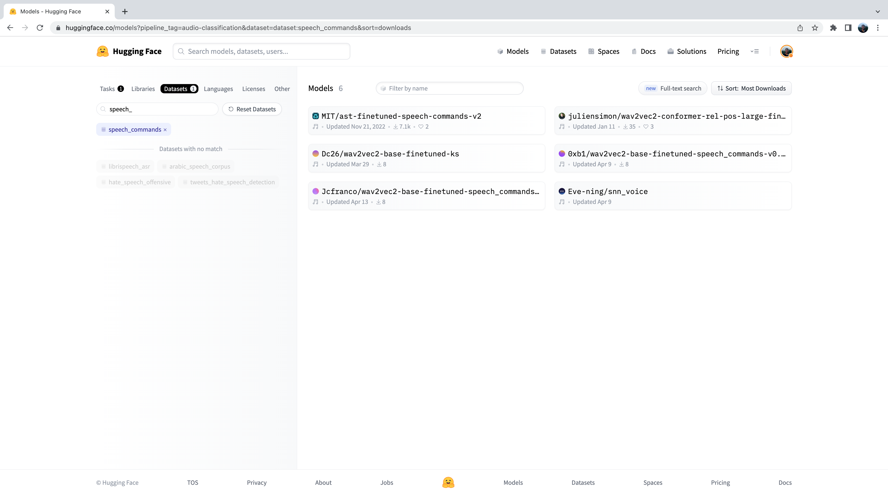

# 用于音频分类的预训练模型和数据集
Hugging Face Hub拥有 500 多个用于音频分类的预训练模型。在本节中，我们将介绍一些最常见的音频分类任务，并为每个任务推荐合适的预训练模型。使用 `pipeline()` 类，模型和任务之间的切换非常简单--一旦你知道如何在一个模型上使用 `pipeline()`，你就可以在 Hub 上的任何模型上使用它，而无需修改代码！这使得使用 `pipeline()` 类进行实验的速度极快，您可以根据需要快速选择最佳的预训练模型。

在讨论各种音频分类问题之前，让我们先快速回顾一下通常使用的Transformer架构。标准音频分类架构是由任务的性质所决定的；我们希望将音频输入序列（即我们的输入音频阵列）转换为单类标签预测。纯编码器模型首先将输入音频序列通过转换器块映射为隐态表示序列。然后，通过对隐藏状态取平均值，将隐藏状态表示序列映射为类别标签输出，并将得到的向量通过线性分类层。因此，在音频分类中，人们倾向于使用*纯编码器*模型。

纯解码器模型给任务带来了不必要的复杂性，因为它们假定输出也可以是一系列预测（而不是单一的类标签预测），因此会产生多个输出。因此，它们的推理速度较慢，往往不被采用。出于同样的原因，编码器-解码器模型在很大程度上也被省略了。这些架构选择类似于 NLP 中的架构选择，在 NLP 中，只用编码器的模型（如 [BERT](https://arxiv.org/abs/1810.04805）适用于序列分类任务，只用解码器的模型（如 GPT）适用于序列生成任务。

既然我们已经简要介绍了音频分类的标准Transformer架构，下面就让我们跳转到音频分类的不同子集，并介绍最流行的模型！

## Hugging Face Transformers安装
在撰写本文时，音频分类流水线所需的最新更新仅在Hugging Face `Transformers` 软件源的 `main`版本上，而不是最新的 PyPi 版本上。为了确保本地有这些更新，我们将使用以下命令从`main`分支安装 Transformers：

```python
pip install git+https://github.com/huggingface/transformers
```

## 关键词定位
关键词定位（Keyword spotting, KWS）是指在口语中识别关键词的任务。可能的关键词集构成了预测的类标签集。因此，要使用预先训练好的关键词定位模型，您应该确保您的关键词与模型预先训练好的关键词相匹配。下面，我们将介绍两个数据集和关键词定位模型。

### Minds-14
让我们继续使用在上一单元中探索过的 [MINDS-14](https://huggingface.co/datasets/PolyAI/minds14) 数据集。如果您还记得，MINDS-14 包含了人们用多种语言和方言向电子银行系统提问的录音，每段录音都有 `intent_class`。我们可以根据通话意图对录音进行分类。

```python
from datasets import load_dataset

minds = load_dataset("PolyAI/minds14", name="en-AU", split="train")
```

我们将加载检查点 [`"anton-l/xtreme_s_xlsr_300m_minds14"`](https://huggingface.co/anton-l/xtreme_s_xlsr_300m_minds14)，这是一个在 MINDS-14 上微调了约 50 个epoch的 XLS-R 模型。在验证集上，它对 MINDS-14 的所有语言都达到了 90% 的准确率。

```python
from transformers import pipeline

classifier = pipeline(
    "audio-classification",
    model="anton-l/xtreme_s_xlsr_300m_minds14",
)
```

最后，我们可以将样本传递给分类流水线进行预测：

```python
classifier(minds[0]["path"])
```

输出：

```python
[
    {"score": 0.9631525278091431, "label": "pay_bill"},
    {"score": 0.02819698303937912, "label": "freeze"},
    {"score": 0.0032787492964416742, "label": "card_issues"},
    {"score": 0.0019414445850998163, "label": "abroad"},
    {"score": 0.0008378693601116538, "label": "high_value_payment"},
]
```

太好了！我们已经确定来电的意图是支付账单，概率为 96%。您可以想象一下，这种关键词识别系统被用作自动呼叫中心的第一阶段，我们希望根据客户的询问对来电进行分类，并为他们提供相应的情景化支持。

### 语音命令
语音命令是一个口语单词数据集，用于评估简单命令单词的音频分类模型。该数据集由 15 个关键词类别、一个无声类别和一个未知类别（包括假阳性）组成。这 15 个关键词都是单词，通常在设备设置中用于控制基本任务或启动其他进程。

类似的模型也在您的手机上持续运行。在这里，我们使用的不是单个命令词，而是特定于设备的 "唤醒词"，例如 "Hey Google "或 "Hey Siri"。当音频分类模型检测到这些唤醒词时，它会触发手机开始监听麦克风，并使用语音识别模型转录您的语音。

音频分类模型比语音识别模型小得多、轻得多，通常只有几百万个参数，而语音识别则需要几亿个参数。因此，它可以在设备上持续运行，而不会耗尽电池！只有在检测到唤醒词时，才会启动较大的语音识别模型，然后再次关闭。我们将在下一单元介绍语音识别的Transformer模型，因此在课程结束时，您应该已经掌握了构建自己的语音激活助手所需的工具！

对于 Hugging Face Hub 上的任何数据集，我们都可以在不下载或不记忆的情况下了解其音频数据的类型。进入 Hub 上的[语音命令数据集卡](https://huggingface.co/datasets/speech_commands)后，我们可以使用数据集查看器滚动浏览数据集的前 100 个样本，聆听音频文件并查看任何其他元数据信息：


数据集预览是在使用音频数据集之前体验它们的绝佳方式。您可以在 Hub 上选择任何数据集，滚动浏览样本，聆听不同子集和分集的音频，从而判断该数据集是否适合您的需求。选定数据集后，加载数据就变得轻而易举，您就可以开始使用它了。

让我们使用流模式加载语音命令数据集样本：

```python
speech_commands = load_dataset(
    "speech_commands", "v0.02", split="validation", streaming=True
)
sample = next(iter(speech_commands))
```

我们将在命名空间 [`"MIT/ast-finetuned-speech-commands-v2 "`](https://huggingface.co/MIT/ast-finetuned-speech-commands-v2)下加载一个官方[音频频谱图Transformer](https://huggingface.co/docs/transformers/model_doc/audio-spectrogram-transformer)检查点，该检查点在语音命令数据集上进行了微调：

```python
classifier = pipeline(
    "audio-classification", model="MIT/ast-finetuned-speech-commands-v2"
)
classifier(sample["audio"].copy())
```

输出:

```python
[{'score': 0.9999892711639404, 'label': 'backward'},
 {'score': 1.7504888774055871e-06, 'label': 'happy'},
 {'score': 6.703040185129794e-07, 'label': 'follow'},
 {'score': 5.805884484288981e-07, 'label': 'stop'},
 {'score': 5.614546694232558e-07, 'label': 'up'}]
```

真酷！看来示例中包含 "backward "一词的概率很高。我们可以听一听样本，验证一下是否正确：

```python
from IPython.display import Audio

Audio(sample["audio"]["array"], rate=sample["audio"]["sampling_rate"])
```

现在，你可能想知道我们是如何选择这些预训练模型，并在这些音频分类示例中向你展示的。事实上，为你的数据集和任务找到预训练模型非常简单！我们需要做的第一件事就是前往Hugging Face Hub，点击 ["Models"选项卡](https://huggingface.co/models)。

这将显示 Hugging Face Hub 上的所有模型，按过去 30 天的下载量排序：



您会发现在左侧有一系列选项卡，我们可以选择这些选项卡来按任务、库、数据集等过滤模型。向下滚动，从音频任务列表中选择 "音频分类 "任务：


现在我们看到的是 Hub 上 500 多个音频分类模型的子集。要进一步完善这一选择，我们可以按数据集过滤模型。点击 "数据集 "标签，在搜索框中输入 "speech_commands"。开始输入时，您会看到搜索选项卡下方出现 `speech_commands `选项。您可以单击此按钮，将所有音频分类模型过滤为在语音命令数据集上进行微调的模型：



太好了！我们可以看到，对于这个特定的数据集和任务，我们有 6 个预先训练好的模型可用。其中第一个模型就是我们在上一个例子中使用的音频谱图转换器检查点。在 Hub 上筛选模型的过程正是我们选择检查点的过程！

## 语言识别
语言识别 (Language Identification, LID) 是指从候选语言列表中识别音频样本中的语言。语言识别是许多语音流水线的重要组成部分。例如，给定一个未知语言的音频样本，LID 模型可用于对音频样本中的语言进行分类，然后选择一个经过该语言训练的适当语音识别模型来转录音频。

### FLEURS
FLEURS（Few-shot Learning Evaluation of Universal Representations of Speech）是一个用于评估 102 种语言的语音识别系统的数据集，其中包括许多被归类为 "低资源"的语言。请查看Hub上的 FLEURS 数据集卡，探索其中的不同语言：[google/fleurs](https://huggingface.co/datasets/google/fleurs)。您能在这里找到您的母语吗？如果找不到，最接近的语言是什么？

让我们使用流模式加载 FLEURS 数据集验证分割的样本：

```python
fleurs = load_dataset("google/fleurs", "all", split="validation", streaming=True)
sample = next(iter(fleurs))
```

太好了！现在我们可以加载音频分类模型了。为此，我们将使用在 FLEURS 数据集上微调过的 [Whisper](https://arxiv.org/pdf/2212.04356.pdf) 版本，它是目前 Hub 上性能最好的 LID 模型：

```python
classifier = pipeline(
    "audio-classification", model="sanchit-gandhi/whisper-medium-fleurs-lang-id"
)
```

然后，我们就可以通过分类器对音频进行分类，并生成预测结果：

```python
classifier(sample["audio"])
```

输出：

```python
[{'score': 0.9999330043792725, 'label': 'Afrikaans'},
 {'score': 7.093023668858223e-06, 'label': 'Northern-Sotho'},
 {'score': 4.269149485480739e-06, 'label': 'Icelandic'},
 {'score': 3.2661141631251667e-06, 'label': 'Danish'},
 {'score': 3.2580724109720904e-06, 'label': 'Cantonese Chinese'}]
```

我们可以看到，模型预测音频为南非荷兰语的概率极高（接近 1）。FLEURS 数据集包含多种语言的音频数据，我们可以看到可能的类标签包括北索托语、冰岛语、丹麦语和粤语等。您可以在数据集卡上找到完整的语言列表：[google/fleurs](https://huggingface.co/datasets/google/fleurs)。

交给你了！你还能在 Hub 上找到 FLEURS LID 的哪些检查点？他们内在的Transformer模型是什么？

## Zero-Shot音频分类
在传统的音频分类范例中，模型会从一组预定义的可能类别中预测类别标签。这对使用预训练模型进行音频分类构成了障碍，因为预训练模型的标签集必须与下游任务的标签集相匹配。在前面的 LID 例子中，模型必须预测它所训练的 102 个语言类别中的一个。如果下游任务实际需要 110 种语言，那么该模型将无法预测 110 种语言中的 8 种，因此需要重新训练才能实现完全覆盖。这就限制了迁移学习在音频分类任务中的有效性。

Zero-shot音频分类是一种方法，它将预先训练好的音频分类模型在一组标记过的示例上进行训练，使其能够对来自以前未见过的类别的新示例进行分类。让我们来看看如何实现这一目标！

目前，Hugging Face `Transformers` 支持一种用于zero-shot音频分类的模型：[CLAP 模型](https://huggingface.co/docs/transformers/model_doc/clap。CLAP 是一种基于Transformer的模型，它将音频和文本作为输入，并计算两者之间的相似度。如果我们传递的文本输入与音频输入有很强的相关性，我们就会得到很高的相似性分数。反之，如果传递一个与音频输入完全无关的文本输入，则会得到较低的相似度。

我们可以通过向模型传递一个音频输入和多个候选标签，将这种相似性预测用于zero-shot音频分类。模型将返回每个候选标签的相似度得分，我们可以选择得分最高的标签作为我们的预测结果。

让我们以Environmental Speech Challenge（ESC）数据集中的音频输入为例进行说明：

```python
dataset = load_dataset("ashraq/esc50", split="train", streaming=True)
audio_sample = next(iter(dataset))["audio"]["array"]
```

然后，我们定义候选标签，它们构成了可能的分类标签集。模型将为我们定义的每个标签返回分类概率。这意味着我们需要事先知道分类问题中可能的标签集，以便正确的标签包含在这个标签集中，并因此被分配一个有效的概率分数。需要注意的是，我们既可以向模型传递全套标签，也可以手工选择一个我们认为包含正确标签的子集。传递全套标签会更详尽，但代价是分类准确率会降低，因为分类空间更大（前提是正确标签是我们选择的标签子集）：

```python
candidate_labels = ["Sound of a dog", "Sound of vacuum cleaner"]
```

我们可以通过模型运行这两个标签，找出与音频输入*最相似的*候选标签：

```python
classifier = pipeline(
    task="zero-shot-audio-classification", model="laion/clap-htsat-unfused"
)
classifier(audio_sample, candidate_labels=candidate_labels)
```

输出：

```python
[{'score': 0.9997242093086243, 'label': 'Sound of a dog'}, {'score': 0.0002758323971647769, 'label': 'Sound of vacuum cleaner'}]
```

好吧！模型似乎对狗的声音很有信心--它的预测概率高达 99.96%，所以我们就把它作为我们的预测。让我们通过聆听音频样本来确认我们的预测是否正确（不要把音量开得太大，否则可能会被吓到！）：

```python
Audio(audio_sample, rate=16000)
```

完美！我们得到了狗叫声 :dog:，这与模型的预测一致。尝试使用不同的音频样本和不同的候选标签--您能否定义一组标签，使其在整个 ESC 数据集中具有良好的通用性？提示：想想你能从哪里找到有关 ESC 中可能出现的声音的信息，并据此构建你的标签！

您可能想知道，为什么我们不在所有音频分类任务中使用zero-shot分类流水线？我们似乎可以通过事先定义适当的类标签来预测任何音频分类问题，从而绕过分类任务需要与模型预先训练的标签相匹配的限制。这归结于 zero-shot流水线中使用的 CLAP 模型的性质： CLAP 是在通用音频分类数据（类似于 ESC 数据集中的环境声音）上预先训练的，而不是像我们在 LID 任务中所使用的那样，专门针对语音数据。如果你给它提供英语语音和西班牙语语音，CLAP 会知道这两个例子都是语音数据，但它无法像专门的 LID 模型那样区分语言。

## 下一步是什么？
我们已经介绍了许多不同的音频分类任务，并展示了最相关的数据集和模型，您可以从 Hugging Face Hub 下载这些数据集和模型，并使用 `pipeline()` 类编写几行代码即可使用。这些任务包括关键词定位、语言识别和zero-shot音频分类。

但是，如果我们想做一些**新**的事情呢？我们在语音处理任务方面做了大量工作，但这只是音频分类的一个方面。音频处理的另一个热门领域涉及**音乐**。虽然音乐具有与语音不同的固有特征，但我们已经学到的许多相同原理也可以应用于音乐。

在下面的章节中，我们将逐步指导您如何使用Hugging Face `Transformers`对transformer模型进行微调，以完成音乐分类任务。在本节结束时，您将得到一个经过微调的检查点，可以将其插入` pipeline() `类，从而以与我们在此对语音进行分类完全相同的方式对歌曲进行分类！