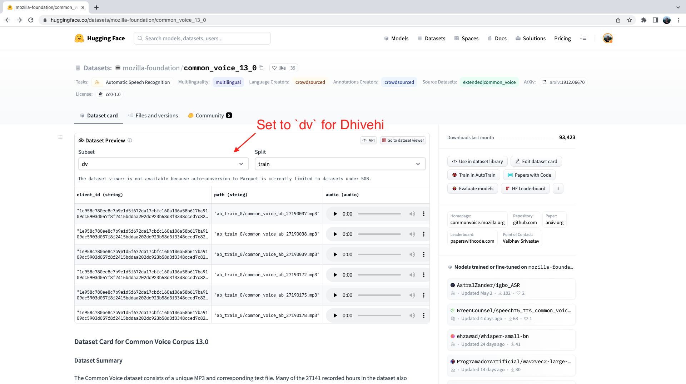

# 选择数据集
与任何机器学习问题一样，我们的模型只有在训练数据的基础上才能达到最佳效果。语音识别数据集在整理方式和覆盖领域方面存在很大差异。要选择正确的数据集，我们需要将我们的标准与数据集提供的功能相匹配。

在选择数据集之前，我们首先需要了解数据集的关键定义特征。

## 语音数据集的特点

1. 小时数
  简单地说，训练时数表示数据集的规模。这类似于 NLP 数据集中训练示例的数量。然而，数据集并不一定越大越好。如果我们想要一个能很好泛化的模型，我们就需要一个包含大量不同说话者、领域和说话风格的多样化数据集。

2. 领域
  领域是指数据的来源，无论是有声读物、播客、YouTube 还是金融会议。每个领域都有不同的数据分布。例如，有声读物是在高质量的录音室条件下录制的（没有背景噪音），文本取自书面文献。而对于 YouTube，音频可能包含更多的背景噪音和更非正式的演讲风格。我们需要将我们的领域与推理时预期的条件相匹配。例如，如果我们在有声读物上训练模型，就不能指望它在嘈杂的环境中表现出色。

3. 演讲风格
  演讲风格可分为两类：

  - 叙述式：照稿宣读

  - 即兴演讲：无脚本、对话式演讲

  - 音频和文本数据反映了说话风格。由于叙述文本是有脚本的，因此往往口齿清晰，没有任何错误：

  - ```python
    “Consider the task of training a model on a speech recognition dataset”
    ```

  - 而对于即兴演讲，我们可以期待更口语化的演讲风格，包括重复、犹豫和假开头：

  - ```python
    “Let’s uhh let's take a look at how you'd go about training a model on uhm a sp- speech recognition dataset”
    ```

4. 转录风格
  转录风格是指目标文本是否有标点符号、大小写或两者兼有。如果我们希望系统生成可用于出版物或会议转录的完全格式化文本，我们就需要带有标点和大小写的训练数据。如果我们只需要未格式化结构的口语，那么标点和大小写都没有必要。在这种情况下，我们可以选择一个不带标点符号和大小写的数据集，或者选择一个带标点符号和大小写的数据集，然后通过预处理将它们从目标文本中去除。

## Hub上的数据集汇总

以下是 "Hugging Face Hub "上最流行的英语语音识别数据集摘要：

| 数据集                                                       | 训练小时数 | 领域                    | 说话风格         | 标点符号 | 大小写 | 证书            | 推荐用途         |
| ------------------------------------------------------------ | ---------- | ----------------------- | ---------------- | -------- | ------ | --------------- | ---------------- |
| [LibriSpeech](https://huggingface.co/datasets/librispeech_asr) | 960        | 有声读物                | 叙述式           | ❌        | ❌      | CC-BY-4.0       | 学术基准         |
| [Common Voice 11](https://huggingface.co/datasets/mozilla-foundation/common_voice_11_0) | 3000       | 维基百科                | 叙述式           | ✅        | ✅      | CC0-1.0         | 非母语人士       |
| [VoxPopuli](https://huggingface.co/datasets/facebook/voxpopuli) | 540        | 欧洲议会                | 演讲             | ❌        | ✅      | CC0             | 非母语人士       |
| [TED-LIUM](https://huggingface.co/datasets/LIUM/tedlium)     | 450        | TED演讲                 | 演讲             | ❌        | ❌      | CC-BY-NC-ND 3.0 | 技术主题         |
| [GigaSpeech](https://huggingface.co/datasets/speechcolab/gigaspeech) | 10000      | 有声读物、播客、YouTube | 叙述式、即兴演讲 | ❌        | ✅      | apache-2.0      | 多个领域的鲁棒性 |
| [SPGISpeech](https://huggingface.co/datasets/kensho/spgispeech) | 5000       | 金融会议                | 演讲、即兴演讲   | ✅        | ✅      | User Agreement  | 完全格式化的转录 |
| [Earnings-22](https://huggingface.co/datasets/revdotcom/earnings22) | 119        | 金融会议                | 演讲、即兴演讲   | ✅        | ✅      | CC-BY-SA-4.0    | 口音多样性       |
| [AMI](https://huggingface.co/datasets/edinburghcstr/ami)     | 100        | 会议                    | 即兴演讲         | ✅        | ✅      | CC-BY-4.0       | 嘈杂的语音条件   |

此表可作为根据您的标准选择数据集的参考。下面是多语言语音识别的相应表格。请注意，我们省略了 "训练时数 "一栏，因为这取决于每个数据集的语言，而代之以每个数据集的语言数：

| 数据集                                                       | 语言数 | 领域                   | 说话风格 | 标点符号 | 大小写 | 证书      | 推荐用途           |
| ------------------------------------------------------------ | ------ | ---------------------- | -------- | -------- | ------ | --------- | ------------------ |
| [Multilingual LibriSpeech](https://huggingface.co/datasets/facebook/multilingual_librispeech) | 6      | 有声读物               | 叙述式   | ❌        | ❌      | CC-BY-4.0 | 学术基准           |
| [Common Voice 13](https://huggingface.co/datasets/mozilla-foundation/common_voice_13_0) | 108    | 维基百科文本、众包语音 | 叙述式   | ✅        | ✅      | CC0-1.0   | 多样化的演讲者组合 |
| [VoxPopuli](https://huggingface.co/datasets/facebook/voxpopuli) | 15     | 欧洲议会录音           | 自发演讲 | ❌        | ✅      | CC0       | 欧洲语言           |
| [FLEURS](https://huggingface.co/datasets/google/fleurs)      | 101    | 欧洲议会录音           | 自发演讲 | ❌        | ❌      | CC-BY-4.0 | 多语言评估         |

有关两张表格中涵盖的音频数据集的详细分类，请参阅博文[《音频数据集完全指南》](https://huggingface.co/blog/audio-datasets#a-tour-of-audio-datasets-on-the-hub)。虽然 Hub 上有 180 多个语音识别数据集，但可能没有一个数据集能满足您的需求。在这种情况下，也可以使用 Hugging Face `Datasets`来使用自己的音频数据。要创建自定义音频数据集，请参阅[创建音频数据集指南](https://huggingface.co/docs/datasets/audio_dataset)。创建自定义音频数据集时，请考虑在 Hub 上共享最终数据集，这样社区中的其他人也能从您的努力中获益--音频社区具有包容性和广泛性，其他人也会像您一样欣赏您的工作。

好了！既然我们已经了解了选择 ASR 数据集的所有标准，那就让我们为本教程的目的挑选一个数据集吧。我们知道，Whisper 在转录高资源语言（如英语和西班牙语）数据方面已经做得相当出色，因此我们将专注于低资源多语言转录。我们希望保留 Whisper 预测标点符号和大小写的能力，因此从第二个表格中可以看出，Common Voice 13 是一个很好的候选数据集！

## Common Voice 13
Common Voice 13 是一个众包数据集，由发言者用各种语言录制维基百科中的文本。它是 Mozilla 基金会发布的 Common Voice 系列数据集的一部分。在撰写本文时，Common Voice 13 是该数据集的最新版本，语言种类和每种语言的使用时长都是迄今为止所有版本中最多的。

我们可以通过查看 Hub 上的[数据集页面](https://huggingface.co/datasets/mozilla-foundation/common_voice_13_0)获取 Common Voice 13 数据集的完整语言列表。首次查看此页面时，您将被要求接受使用条款。之后，你就可以完全访问数据集了。

通过身份验证后，我们将看到数据集预览。数据集预览显示了每种语言数据集的前 100 个样本。此外，它还加载了音频样本，供我们实时收听。在本单元中，我们将选择[迪维希语](https://en.wikipedia.org/wiki/Maldivian_language)（或马尔代夫语），这是一种在南亚岛国马尔代夫使用的印度-雅利安语。虽然本教程选择的是迪维希语，但这里涉及的步骤适用于 Common Voice 13 数据集中 108 种语言中的任何一种，更广泛地说，适用于 Hugging Face Hub 上 180 多种音频数据集中的任何一种，因此对语言或方言没有限制。

我们可以使用下拉菜单将子集设置为 dv（dv 是迪维希语的语言识别码），从而选择 Common Voice 13 的迪维希语子集：



如果我们点击第一个样本上的播放按钮，就能听到音频并看到相应的文本。请浏览训练集和测试集的样本，以便更好地了解我们正在处理的音频和文本数据。从音调和风格上可以看出，这些录音来自旁白。你还可能会注意到说话者和录音质量的巨大差异，这也是众包数据的共同特征。

数据集预览是在使用音频数据集之前体验它们的绝佳方式。您可以在Hub上选择任何数据集，滚动浏览样本，聆听不同子集和分集的音频，从而衡量该数据集是否适合您的需求。选定数据集后，加载数据就变得轻而易举，您就可以开始使用它了。

现在，我个人不会说迪维希语，估计绝大多数读者也不会！要想知道我们的微调模型是否优秀，我们需要一种严格的方法，在未见过的数据上对其进行评估，并衡量其转录准确性。我们将在下一节介绍这一点！