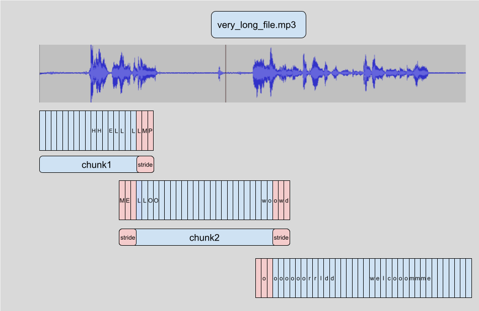

# 用于自动语音识别的预训练模型
在本节中，我们将介绍如何使用 `pipeline()` 利用预训练模型进行语音识别。在[第二单元](chapter2/automatic_speech_recognition_with_a_pipeline.md)中，我们介绍了 `pipeline()` 作为运行语音识别任务的一种简便方法，其所有预处理和后处理都在内部进行，并且可以灵活快速地使用 Hugging Face Hub 上的任何预训练检查点进行实验。在本单元中，我们将更深入地探索语音识别模型的不同属性，以及如何使用它们来处理一系列不同的任务。

如第 3 单元所述，语音识别模型大致可分为两类：

+ 连接时序分类 (CTC)：仅编码器模型，上面有线性分类 (CTC) 头
+ 序列到序列 (Seq2Seq)：编码器-解码器模型，编码器和解码器之间有交叉注意机制

2022 年之前，CTC 是两种架构中更受欢迎的一种，Wav2Vec2、HuBERT 和 XLSR 等仅编码器模型在语音预训练/微调范式方面取得了突破性进展。Meta 和微软等大公司对大量未标记的音频数据进行了长达数天或数周的编码器预训练。然后，用户可以使用预先训练好的检查点，用 CTC 头在短短 **10 分钟**的标注语音数据上对其进行微调，从而在下游语音识别任务中取得优异的性能。

不过，CTC 模型也有不足之处。在编码器上附加一个简单的线性层可以得到一个小而快的整体模型，但容易出现语音拼写错误。下面我们将对 Wav2Vec2 模型进行演示。

## 探索 CTC 模型
让我们加载 [LibriSpeech ASR](https://www.openslr.org/12) 数据集的一小部分，以演示 Wav2Vec2 的语音转录功能：

```python
from datasets import load_dataset

dataset = load_dataset(
    "hf-internal-testing/librispeech_asr_dummy", "clean", split="validation"
)
dataset
```

输出：

```python
Dataset({
    features: ['file', 'audio', 'text', 'speaker_id', 'chapter_id', 'id'],
    num_rows: 73
})
```

我们可以从 73 个音频样本中选择一个，检查音频样本和转录：

```python
from IPython.display import Audio

sample = dataset[2]

print(sample["text"])
Audio(sample["audio"]["array"], rate=sample["audio"]["sampling_rate"])
```

输出：

```python
HE TELLS US THAT AT THIS FESTIVE SEASON OF THE YEAR WITH CHRISTMAS AND ROAST BEEF LOOMING BEFORE US SIMILES DRAWN FROM EATING AND ITS RESULTS OCCUR MOST READILY TO THE MIND
```

好吧！圣诞节和烤牛肉，听起来不错！选择了数据样本后，我们现在要将经过微调的检查点加载到 `pipeline()` 中。为此，我们将使用基于 100 小时 LibriSpeech 数据微调的官方 Wav2Vec2 base检查点：

```python
from transformers import pipeline

pipe = pipeline("automatic-speech-recognition", model="facebook/wav2vec2-base-100h")
```

接下来，我们将从数据集中提取一个示例，并将其原始数据传递给流水线。由于流水线会消耗我们传递给它的任何字典（这意味着字典不能重复使用），因此我们将传递一份数据副本。这样，我们就可以在下面的示例中安全地重复使用同一个音频样本：

```python
pipe(sample["audio"].copy())
```

输出：

```python
{"text": "HE TELLS US THAT AT THIS FESTIVE SEASON OF THE YEAR WITH CHRISTMAUS AND ROSE BEEF LOOMING BEFORE US SIMALYIS DRAWN FROM EATING AND ITS RESULTS OCCUR MOST READILY TO THE MIND"}
```

我们可以看到，Wav2Vec2 模型在转录这个样本方面做得相当出色--乍一看，它大致上是正确的。让我们将目标音和预测音并排放在一起，突出它们之间的差异：

```python
Target:      HE TELLS US THAT AT THIS FESTIVE SEASON OF THE YEAR WITH CHRISTMAS AND ROAST BEEF LOOMING BEFORE US SIMILES DRAWN FROM EATING AND ITS RESULTS OCCUR MOST READILY TO THE MIND
Prediction:  HE TELLS US THAT AT THIS FESTIVE SEASON OF THE YEAR WITH **CHRISTMAUS** AND **ROSE** BEEF LOOMING BEFORE US **SIMALYIS** DRAWN FROM EATING AND ITS RESULTS OCCUR MOST READILY TO THE MIND
```

对比目标文本和预测转录，我们可以发现所有单词的读音都是正确的，但有些单词的拼写并不准确。例如

+ CHRISTMAUS vs. CHRISTMAS
+ ROSE vs. ROAST
+ SIMALYIS vs. SIMILES

这凸显了 CTC 模型的缺陷。CTC 模型本质上是一个 "纯声学 "模型：它由一个编码器和一个线性层组成，编码器根据音频输入形成隐藏状态表示，线性层则将隐藏状态映射为字符：

这意味着系统的预测几乎完全基于声学输入（音频的语音），因此倾向于以语音方式转录音频（如 *CHRISTMAUS*）。它不太重视前面和后面字母的语言建模上下文，因此容易出现音标拼写错误。一个更智能的模型会识别出 CHRISTMAUS 在英语词汇中不是一个有效的单词，并在预测时将其更正为 CHRISTMAS。在我们的预测中还缺少了两个重要的特征--大小写和标点符号，这限制了模型转录在实际应用中的实用性。

## 毕业于 Seq2Seq
提示 Seq2Seq 模型！如第三单元所述，Seq2Seq 模型是由编码器和解码器通过交叉注意机制连接而成的。编码器的作用和以前一样，计算音频输入的隐态表示，而解码器则扮演语言模型的角色。解码器处理来自编码器的整个隐态表示序列，并生成相应的文本转录。有了音频输入的全局上下文，解码器就能在预测时使用语言模型上下文，即时纠正拼写错误，从而避免了语音预测的问题。

Seq2Seq 模型有两个缺点：

1. 由于解码过程是一步一步进行的，而不是一次完成的，因此它们的解码速度天生较慢

2. 它们对数据的需求更大，需要更多的训练数据才能达到收敛。

特别是，需要大量的训练数据一直是语音 Seq2Seq 架构发展的瓶颈。标注的语音数据很难获得，当时最大的标注数据集仅有 10,000 小时。2022 年，随着 **Whisper** 的发布，这一切都改变了。Whisper 是一种用于语音识别的预训练模型，由 OpenAI 的作者 Alec Radford 等人于 [2022 年 9 月](https://openai.com/research/whisper)发布。与完全在**未标记**的音频数据上进行预训练的 CTC 前辈们不同，Whisper 是在大量已**标记**的音频转录数据上进行预训练的，准确地说，是 68 万小时。

这比用于训练 Wav2Vec 2.0 的未标记音频数据（60,000 小时）要多出一个数量级。此外，在这些预训练数据中，有 11.7 万小时是多语言（或 "非英语"）数据。因此，检查点可应用于超过 96 种语言，其中许多语言被认为是*低资源*语言，这意味着这些语言缺乏适合训练的大量数据。

当扩展到 680,000 小时的标记预训练数据时，Whisper 模型显示出了对许多数据集和领域的强大泛化能力。在 LibriSpeech 流水线的test-clean子集上，预训练检查点的词错误率（WER）接近 3%，而在 TED-LIUM 上的词错误率为 4.7%，达到了SOTA水平（参见 [Whisper 论文](https://cdn.openai.com/papers/whisper.pdf)中的表 8）。

尤其重要的是，Whisper 能够处理长格式音频样本，对输入噪声具有很强的鲁棒性，并且能够预测带标点的转录。这使它成为现实世界语音识别系统的可行候选方案。

本节的其余部分将向您展示如何使用 Hugging Face `Transformers` 将预训练的 Whisper 模型用于语音识别。在许多情况下，预训练的 Whisper 检查点性能极佳，效果显著，因此我们鼓励您尝试使用预训练的检查点作为解决任何语音识别问题的第一步。通过微调，预训练检查点可以针对特定的数据集和语言进行调整，从而进一步改善这些结果。我们将在接下来的微调小节中演示如何做到这一点。

Whisper 检查点有五种不同规模的模型配置。最小的四个检查点在纯英语或多语言数据上进行训练。最大的检查点仅使用多语言数据。所有九个预先训练好的检查点都可以在 [Hugging Face Hub](https://huggingface.co/models?search=openai/whisper) 上找到。下表概述了这些检查点，并附有与 Hub 上模型的链接。"VRAM "表示运行最小批量为 1 的模型所需的 GPU 内存。"Rel Speed "是检查点与最大模型相比的相对速度。根据这些信息，您可以选择最适合您硬件的检查点。

| Size   | Parameters | VRAM / GB | Rel Speed | English-only                                         | Multilingual                                        |
| ------ | ---------- | --------- | --------- | ---------------------------------------------------- | --------------------------------------------------- |
| tiny   | 39 M       | 1.4       | 32        | [✓](https://huggingface.co/openai/whisper-tiny.en)   | [✓](https://huggingface.co/openai/whisper-tiny)     |
| base   | 74 M       | 1.5       | 16        | [✓](https://huggingface.co/openai/whisper-base.en)   | [✓](https://huggingface.co/openai/whisper-base)     |
| small  | 244 M      | 2.3       | 6         | [✓](https://huggingface.co/openai/whisper-small.en)  | [✓](https://huggingface.co/openai/whisper-small)    |
| medium | 769 M      | 4.2       | 2         | [✓](https://huggingface.co/openai/whisper-medium.en) | [✓](https://huggingface.co/openai/whisper-medium)   |
| large  | 1550 M     | 7.5       | 1         | x                                                    | [✓](https://huggingface.co/openai/whisper-large-v2) |

让我们加载 [Whisper Base](https://huggingface.co/openai/whisper-base) 检查点，它的大小与我们之前使用的 Wav2Vec2 检查点相当。在转向多语言语音识别之前，我们将加载基础检查点的多语言变体。如果 GPU 可用，我们还将在 GPU 上加载模型，否则就在 CPU 上加载。随后，`pipeline()` 会根据需要将所有输入/输出从 CPU 转移到 GPU：

```python
import torch
from transformers import pipeline

device = "cuda:0" if torch.cuda.is_available() else "cpu"
pipe = pipeline(
    "automatic-speech-recognition", model="openai/whisper-base", device=device
)
```

很好！现在，让我们像以前一样转录音频。我们所做的唯一改变是传递一个额外的参数 `max_new_tokens`，它告诉模型在进行预测时要生成的最大token数：

```python
pipe(sample["audio"], max_new_tokens=256)
```

输出：

```python
{'text': ' He tells us that at this festive season of the year, with Christmas and roast beef looming before us, similarly is drawn from eating and its results occur most readily to the mind.'}
```

很简单！您会注意到的第一件事是，我们同时使用了大小写和标点符号。与 Wav2Vec2 中未加大小写和标点符号的转录相比，这立即使转录更易于阅读。让我们将转录内容与目标内容并排显示：

```python
Target:     HE TELLS US THAT AT THIS FESTIVE SEASON OF THE YEAR WITH CHRISTMAS AND ROAST BEEF LOOMING BEFORE US SIMILES DRAWN FROM EATING AND ITS RESULTS OCCUR MOST READILY TO THE MIND
Prediction: He tells us that at this festive season of the year, with **Christmas** and **roast** beef looming before us, **similarly** is drawn from eating and its results occur most readily to the mind.
```

Whisper 很好地纠正了我们从 Wav2Vec2 中看到的语音错误--Christmas 和 roast 都拼写正确。我们看到，该模型在处理 *SIMILES* 时仍然很吃力，被错误地转录为 *similarly*，但这次预测的是英语词库中的一个有效单词。使用更大的 Whisper 检查点有助于进一步减少转录错误，但代价是需要更多的计算量和更长的转录时间。

我们已经得到了可以处理 96 种语言的模型的承诺，所以让我们暂时抛开英语语音识别，转而进行全球范围的语音识别！[Multilingual LibriSpeech (MLS)](https://huggingface.co/datasets/facebook/multilingual_librispeech) 数据集相当于多语言 LibriSpeech 数据集，包含六种语言的标注音频数据。我们将从 MLS 数据集中的西班牙语分集加载一个样本，利用*流媒体*模式，这样就不必下载整个数据集：

```python
dataset = load_dataset(
    "facebook/multilingual_librispeech", "spanish", split="validation", streaming=True
)
sample = next(iter(dataset))
```

我们将再次检查文字转录，并聆听音频片段：

```python
print(sample["text"])
Audio(sample["audio"]["array"], rate=sample["audio"]["sampling_rate"])
```

输出：

```python
entonces te delelitarás en jehová y yo te haré subir sobre las alturas de la tierra y te daré á comer la heredad de jacob tu padre porque la boca de jehová lo ha hablado
```

这就是我们的 Whisper 转录目标文本。不过我们现在知道，我们也许可以做得更好，因为我们的模型还将预测标点符号和大小写，而这两者在参考文献中都不存在。让我们将音频样本转发给流水线，以获得文本预测结果。需要注意的一点是，流水线会*消耗*我们输入的音频输入字典，这意味着字典不能重复使用。为了避免这种情况，我们将传递音频样本的*副本*，这样就可以在接下来的代码示例中重复使用相同的音频样本：

```python
pipe(sample["audio"].copy(), max_new_tokens=256, generate_kwargs={"task": "transcribe"})
```

输出：

```python
{'text': ' Entonces te deleitarás en Jehová y yo te haré subir sobre las alturas de la tierra y te daré a comer la heredad de Jacob tu padre porque la boca de Jehová lo ha hablado.'}
```

很好--这看起来与我们的参考文本非常相似（可以说更好，因为它有标点符号和大小写！）。你会注意到，我们将 `"task"`作为*生成关键字参数*（generate kwarg）。将 `"task"`设置为 `"transcribe"`，将迫使 Whisper 执行语音识别任务，即用与语音相同的语言转录音频。Whisper 还能执行与之密切相关的语音翻译任务，将西班牙语音频翻译成英语文本。为此，我们将 `"task"`设置为 `"translate"`：

```python
pipe(sample["audio"], max_new_tokens=256, generate_kwargs={"task": "translate"})
```

输出：

```python
{'text': ' So you will choose in Jehovah and I will raise you on the heights of the earth and I will give you the honor of Jacob to your father because the voice of Jehovah has spoken to you.'}
```

既然我们知道可以在语音识别和语音翻译之间切换，我们就可以根据自己的需要选择任务。我们可以将 X 语言的音频识别为 X 语言的文本（例如，将西班牙语音频识别为西班牙语文本），或者将任何 X 语言的音频翻译为英语文本（例如，将西班牙语音频识别为英语文本）。

要进一步了解 `"task"`参数如何用于控制生成文本的属性，请参阅 Whisper base模型的[模型卡](https://huggingface.co/openai/whisper-base#usage)。

## 长格式转录和时间戳
到目前为止，我们一直专注于转录少于 30 秒的短音频样本。我们提到 Whisper 的吸引力之一是它能处理长音频样本。我们将在这里完成这项任务！

让我们通过串联 MLS 数据集中的连续样本来创建一个长音频文件。由于 MLS 数据集是通过将较长的有声读物录音分割成较短的片段来制作的，因此串联样本是重建较长有声读物段落的一种方法。因此，得到的音频在整个样本中应该是连贯的。

我们将目标音频长度设定为 5 分钟，一旦达到这个值，就停止串联样本：

```python
import numpy as np

target_length_in_m = 5

# convert from minutes to seconds (* 60) to num samples (* sampling rate)
sampling_rate = pipe.feature_extractor.sampling_rate
target_length_in_samples = target_length_in_m * 60 * sampling_rate

# iterate over our streaming dataset, concatenating samples until we hit our target
long_audio = []
for sample in dataset:
    long_audio.extend(sample["audio"]["array"])
    if len(long_audio) > target_length_in_samples:
        break

long_audio = np.asarray(long_audio)

# how did we do?
seconds = len(long_audio) / 16000
minutes, seconds = divmod(seconds, 60)
print(f"Length of audio sample is {minutes} minutes {seconds:.2f} seconds")
```

输出：

```python
Length of audio sample is 5.0 minutes 17.22 seconds
```

好吧！要转录 5 分 17 秒的音频。将这么长的音频样本直接转发给模型有两个问题：

1. Whisper 本身就是为 30 秒采样而设计的：短于 30 秒的音频会以静音填充到 30 秒，长于 30 秒的音频会通过剪切多余的音频截断到 30 秒。
2. Transformer网络中的内存与序列长度的平方成比例：输入长度增加一倍，内存需求就增加四倍，因此传递超长音频文件必然会导致内存不足 (OOM) 错误。

在 Hugging Face `Transformers` 中，长格式转录的工作方式是将输入音频分成更小、更易于管理的片段。每个片段都与前一个片段有少量重叠。这样，我们就能准确地在边界处将音段拼接在一起，因为我们可以找到音段之间的重叠部分，并相应地合并转录内容：



对样本进行分块处理的好处在于，我们不需要第 $i$ 个分块的结果来转录随后的第 $i+1$ 个分块，而是在转录完所有分块边界的分块后再进行拼接，因此转录分块的顺序并不重要。该算法是完全**无状态**的，因此我们甚至可以在转录第 $i+1$ 块的同时转录第 $i$! 这样，我们就可以批量处理分块，并在模型中并行运行，与顺序转录相比，计算速度大大提高。要了解有关 Hugging Face Transformers 中分块的更多信息，请参阅[本博文](https://huggingface.co/blog/asr-chunking)。

要激活长格式转录，我们必须在调用管道时添加一个额外参数。这个参数，即 `chunk_length_s`，可以控制分块片段的长度（以秒为单位）。对于 Whisper 来说，30 秒的分块长度是最佳选择，因为这与 Whisper 期望的输入长度一致。

要激活批处理，我们需要向流水线传递参数 `batch_size`。综合以上步骤，我们可以用分块和分批的方式转录长音频样本，如下所示：

```python
pipe(
    long_audio,
    max_new_tokens=256,
    generate_kwargs={"task": "transcribe"},
    chunk_length_s=30,
    batch_size=8,
)
```

输出：

```python
{'text': ' Entonces te deleitarás en Jehová, y yo te haré subir sobre las alturas de la tierra, y te daré a comer la
heredad de Jacob tu padre, porque la boca de Jehová lo ha hablado. nosotros curados. Todos nosotros nos descarriamos
como bejas, cada cual se apartó por su camino, mas Jehová cargó en él el pecado de todos nosotros...
```

由于输出结果很长（共 312 个字），我们就不在这里打印了！在 16GB V100 GPU 上，运行上面一行大约需要 3.45 秒，对于 317 秒的音频采样来说已经很不错了。而在 CPU 上，运行时间将近 30 秒。

Whisper 还能预测音频数据的分段级*时间戳*。这些时间戳表示一小段音频的开始和结束时间，对于将转录与输入音频对齐特别有用。假设我们要为视频提供隐藏式字幕，我们需要这些时间戳来了解转录的哪个部分与视频的某个片段相对应，以便在那个时间显示正确的转录。

激活时间戳预测非常简单，我们只需设置参数 `return_timestamps=True`。时间戳与我们之前使用的分块和批处理方法兼容，因此我们只需在之前的调用中添加时间戳参数即可：

```python
pipe(
    long_audio,
    max_new_tokens=256,
    generate_kwargs={"task": "transcribe"},
    chunk_length_s=30,
    batch_size=8,
    return_timestamps=True,
)["chunks"]
```

输出：

```python
[{'timestamp': (0.0, 26.4),
  'text': ' Entonces te deleitarás en Jehová, y yo te haré subir sobre las alturas de la tierra, y te daré a comer la heredad de Jacob tu padre, porque la boca de Jehová lo ha hablado. nosotros curados. Todos nosotros nos descarriamos como bejas, cada cual se apartó por su camino,'},
 {'timestamp': (26.4, 32.48),
  'text': ' mas Jehová cargó en él el pecado de todos nosotros. No es que partas tu pan con el'},
 {'timestamp': (32.48, 38.4),
  'text': ' hambriento y a los hombres herrantes metas en casa, que cuando vieres al desnudo lo cubras y no'},
 ...
```

然后就可以了！我们就有了预测的文本以及相应的时间戳。
## 总结
Whisper 是一种用于语音识别和翻译的强大预训练模型。与 Wav2Vec2 相比，它的转录准确率更高，输出结果包含标点符号和大小写。它既能用于转录英语语音，也能用于转录 96 种其他语言的语音，既能转录较短的音频片段，也能通过*分块*转录较长的音频片段。这些特性使它成为许多语音识别和翻译任务的可行模型，而无需进行微调。`pipeline()` 方法提供了一种在单行 API 调用中运行推理的简便方法，可对生成的预测结果进行控制。

虽然 Whisper 模型在许多高资源语言中表现非常出色，但在低资源语言（即训练数据不易获得的语言）中的转录和翻译准确率较低。在某些语言的不同口音和方言中，它的表现也不尽相同，包括对不同性别、种族、年龄或其他人口统计标准的说话者的准确率较低（参见 [Whisper 论文](https://arxiv.org/pdf/2212.04356.pdf)）。

为了提高低资源语言、口音或方言的性能，我们可以使用预先训练好的 Whisper 模型，并在适当选择的小型语料库中对其进行训练，这一过程称为微调。我们将展示，只需十小时的额外数据，我们就能在低资源语言上将 Whisper 模型的性能提高 100%以上。下一节，我们将介绍选择数据集进行微调的过程。