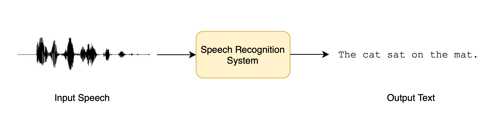

# 你将学到和构建什么
在本节中，我们将了解如何使用Transformer将口语语音转换成文本，这是一项称为*语音识别*的任务。

语音识别，又称自动语音识别（Automatic Speech Recognition, ASR）或语音到文本（Speech-To-Text, STT），是最流行、最令人兴奋的口语处理任务之一。它的应用范围非常广泛，包括听写、语音助手、视频字幕和会议转录。

您可能已经在不知不觉中多次使用过语音识别系统！想想智能手机设备中的数字助理（Siri、谷歌助理、Alexa）。当您使用这些助手时，它们要做的第一件事就是将您的语音转录为书面文本，以便用于任何下游任务（例如为您查找天气信息）。

语音识别是一项具有挑战性的任务，因为它需要音频和文本的共同知识。输入的音频可能有很多背景噪音，说话者的口音也不尽相同，因此很难分辨出语音。书面文本中可能有一些没有声音的字符，如标点符号，这就很难仅从音频中推断出来。这些都是我们在构建有效的语音识别系统时必须解决的障碍！

既然我们已经确定了任务，就可以开始更详细地研究语音识别了。本单元结束时，您将从根本上了解不同的预训练语音识别模型，以及如何使用 Transformers 库。您还将了解在所选领域或语言上对 ASR 模型进行微调的程序，从而能够为所遇到的任何任务构建性能良好的系统。您将能够通过建立一个demo，向您的亲朋好友展示您的模型，该演示可以接收任何口语语音并将其转换为文本！

具体来说，我们将介绍

+ 语音识别的预训练模型
+ 选择数据集
+ 语音识别的评估和衡量标准
+ 如何使用 `Trainer` API 微调 ASR 系统
+ 制作demo
+ 实践练习