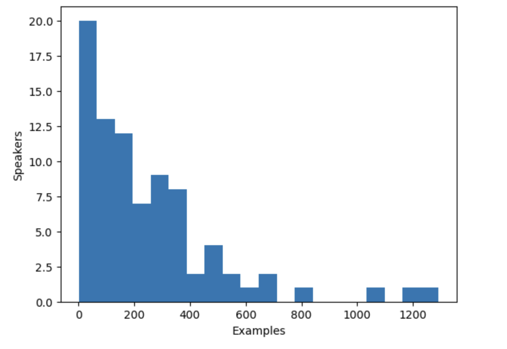
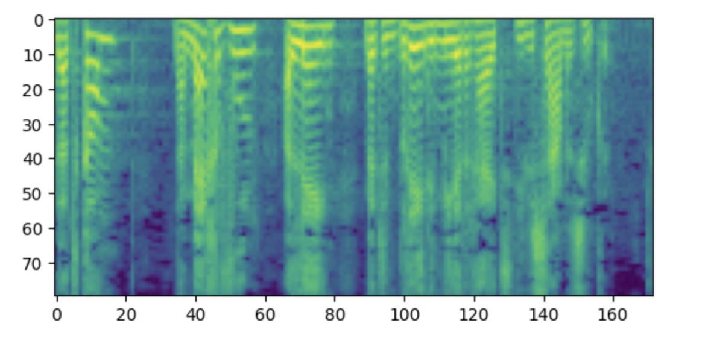

# **微调 SpeechT5** 

现在，您已经熟悉了文本到语音任务和 SpeechT5 模型的内部工作原理，该模型是在英语数据上预先训练好的，让我们看看如何将它微调到另一种语言。

## **内部管理** 

如果您想重现这个例子，请确保您有 GPU。在笔记本电脑中，可以使用以下命令进行检查：

```
nvidia-smi
```

> 在我们的示例中，我们将使用大约 40 小时的训练数据。如果您想使用 Google Colab 免费 GPU 跟随，则需要将训练数据量减少到大约 10-15 小时，并减少训练步骤的数量。

您还需要一些额外的依赖项：

```
pip install transformers datasets soundfile speechbrain accelerate
```

最后，别忘了登录你的 Hugging Face 账户，这样你就可以上传并与社区分享你的模型了：

```python
from huggingface_hub import notebook_login 

notebook_login()
```

## **数据集** 

在本例中，我们将使用 [VoxPopuli](https://huggingface.co/datasets/facebook/voxpopuli) 数据集的荷兰语`(nl`) 语言子集。[VoxPopuli](https://huggingface.co/datasets/facebook/voxpopuli) 是一个大型多语言语音语料库，其数据来源于 2009-2020 年欧洲议会活动录音。它包含 15 种欧洲语言的标注音频转录数据。我们将使用荷兰语子集，也可以选择其他子集。

这是一个自动语音识别（ASR）数据集，因此，如前所述，它不是训练 TTS 模型的最合适选择。不过，对于本练习来说，它已经足够好了。

让我们加载数据：

```python
from datasets import load_dataset, Audio 

dataset = load_dataset("facebook/voxpopuli", "nl", split="train") 
len(dataset)
```

**输出：**

```
20968
```

20968 个示例足以进行微调。SpeechT5 希望音频数据的采样率为 16 kHz，因此要确保数据集中的示例符合这一要求：

```python
dataset = dataset.cast_column("audio", Audio(sampling_rate=16000))
```

## **预处理数据** 

首先，让我们定义要使用的模型检查点，并加载适当的处理器，该处理器包含 tokenizer 和特征提取器，我们需要它们来准备训练数据：

```python
from transformers import SpeechT5Processor 

checkpoint = "microsoft/speecht5_tts" 
processor = SpeechT5Processor.from_pretrained(checkpoint)
```

### **为 SpeechT5 tokenization 清理文本** 

首先，为了准备文本，我们需要处理器的 tokenizer 部分，让我们来获取它：

```python
tokenizer = processor.tokenizer
```

我们来看一个例子：

```python
dataset[0]
```

**输出：**

```
{'audio_id': '20100210-0900-PLENARY-3-nl_20100210-09:06:43_4', 
 'language': 9, 
 'audio': {'path': '/root/.cache/huggingface/datasets/downloads/extracted/02ec6a19d5b97c03e1379250378454dbf3fa2972943504a91c7da5045aa26a89/train_part_0/20100210-0900-PLENARY-3-nl_20100210-09:06:43_4.wav', 
 'array': array([ 4.27246094e-04, 1.31225586e-03, 1.03759766e-03, . ...，-9.15527344e-05，7.62939453e-04，-2.44140625e-04]), 'sampling_rate': 16000}, 
 'raw_text': 'Dat kan naar mijn gevoel alleen met een brede meerderheid die wijen sameken zoeken. '，
 'normalized_text'：'dat kan naar myn gevoel alleen met een brede meerderheid die wij samen zoeken.'，
 'gender'：'female'，
 'speaker_id'：'1122'，
 'is_gold_transcript'： True, 
 'accent': 'None'}
```

您可能会注意到，数据集示例包含原始文本（`raw_text`）和标准化文本（`normalized_text`）特征。在决定使用哪种特征作为文本输入时，重要的是要知道 SpeechT5 tokenizer 没有任何数字标记。在标准化文本 (`normalized_text`) 中，数字被写成文本。因此，它更适合，我们应该使用 `normalized_text` 作为输入文本。

由于 SpeechT5 是在英语语言环境中训练的，因此它可能无法识别荷兰语数据集中的某些字符。如果保持原样，这些字符将被转换为`<unk>`标记。但是，在荷兰语中，某些字符（如`à`）用于强调音节。为了保留文本的意思，我们可以用普通的 `a` 代替这个字符。

要识别不支持的标记，可使用 `SpeechT5Tokenizer` 提取数据集中的所有独特字符，该工具可将字符作为标记使用。为此，我们将编写 `extract_all_chars` 映射函数，将所有示例的转录并入一个字符串，并将其转换为一组字符。请确保在 `dataset.map()` 中设置 `batched=True` 和 `batch_size=-1`，以便映射函数可以一次性使用所有转录。

```python
def extract_all_chars(batch):
    all_text = " ".join(batch["normalized_text"])
    vocab = list(set(all_text))
    return {"vocab": [vocab], "all_text": [all_text]}


vocabs = dataset.map(
    extract_all_chars,
    batched=True,
    batch_size=-1,
    keep_in_memory=True,
    remove_columns=dataset.column_names,
)

dataset_vocab = set(vocabs["vocab"][0])
tokenizer_vocab = {k for k, _ in tokenizer.get_vocab().items()}
```

现在有两组字符：一组是数据集中的词汇，另一组是 tokenizer 中的词汇。要识别数据集中任何不支持的字符，可以取这两组字符的差值。得到的字符集将包含数据集中的字符，但不包含 tokenizer 中的字符。

```
dataset_vocab - tokenizer_vocab
```

**输出：**

```
{' ', 'à', 'ç', 'è', 'ë', 'í', 'ï', 'ö', 'ü'}
```

为了处理上一步中识别出的不支持的字符，我们可以定义一个函数，将这些字符映射为有效的标记。需要注意的是，空格已经在标记符号生成器中被 `▁` 替换，无需单独处理。

```python
replacements = [
    ("à", "a"),
    ("ç", "c"),
    ("è", "e"),
    ("ë", "e"),
    ("í", "i"),
    ("ï", "i"),
    ("ö", "o"),
    ("ü", "u"),
]


def cleanup_text(inputs):
    for src, dst in replacements:
        inputs["normalized_text"] = inputs["normalized_text"].replace(src, dst)
    return inputs


dataset = dataset.map(cleanup_text)
```

现在我们已经处理了文本中的特殊字符，是时候将重点转移到音频数据上了。

### 说话人 

VoxPopuli 数据集包含多个说话人的语音，但数据集中有多少说话人呢？要确定这一点，我们可以计算独特说话者的数量以及每个说话者为数据集贡献的示例数量。数据集中总共有 20968 个示例，这些信息可以让我们更好地了解数据中说话者和示例的分布情况。

```python
from collections import defaultdict

speaker_counts = defaultdict(int)

for speaker_id in dataset["speaker_id"]:
    speaker_counts[speaker_id] += 1
```

通过绘制直方图，您可以了解每个发言人的数据量。

```python
import matplotlib.pyplot as plt

plt.figure()
plt.hist(speaker_counts.values(), bins=20)
plt.ylabel("Speakers")
plt.xlabel("Examples")
plt.show()
```

直方图显示，数据集中约有三分之一的说话人的例子少于 100 个，而约有 10 个说话人的例子超过 500 个。为了提高训练效率并平衡数据集，我们可以将数据限制在 100 到 400 个示例之间。

```python
def select_speaker(speaker_id):
    return 100 <= speaker_counts[speaker_id] <= 400


dataset = dataset.filter(select_speaker, input_columns=["speaker_id"])
```

让我们检查一下还剩下多少发言人：

```python
len(set(dataset["speaker_id"]))
```

**输出：**

```
42
```

我们来看看还剩下多少例子：

```python
len(dataset)
```

**输出： 9973**

```
9973
```

现在只剩下不到 10,000 个例子，这些例子来自大约 40 个不同的说话人，应该足够了。

请注意，如果示例较长，一些示例较少的说话人实际上可能有更多可用音频。不过，要确定每个说话人的音频总量，需要对整个数据集进行扫描，而这是一个耗时的过程，需要对每个音频文件进行加载和解码。因此，我们选择跳过这一步。

### **说话人嵌入** 

为使 TTS 模型能区分多个说话者，您需要为每个示例创建说话人嵌入。说话者嵌入是对模型的额外输入，可捕捉特定说话者的语音特征。要生成这些说话者嵌入，可使用 SpeechBrain 提供的预训练 [spkrec-xvect-voxceleb](https://huggingface.co/speechbrain/spkrec-xvect-voxceleb) 模型。

创建函数 `create_speaker_embedding()` ，该函数接收输入音频波形，并输出包含相应扬声器嵌入的 512 元向量。

```python
import os
import torch
from speechbrain.pretrained import EncoderClassifier

spk_model_name = "speechbrain/spkrec-xvect-voxceleb"

device = "cuda" if torch.cuda.is_available() else "cpu"
speaker_model = EncoderClassifier.from_hparams(
    source=spk_model_name,
    run_opts={"device": device},
    savedir=os.path.join("/tmp", spk_model_name),
)


def create_speaker_embedding(waveform):
    with torch.no_grad():
        speaker_embeddings = speaker_model.encode_batch(torch.tensor(waveform))
        speaker_embeddings = torch.nn.functional.normalize(speaker_embeddings, dim=2)
        speaker_embeddings = speaker_embeddings.squeeze().cpu().numpy()
    return speaker_embeddings
```

值得注意的是，`speechbrain/spkrec-xvect-voxceleb` 模型是在 VoxCeleb 数据集中的英语语音基础上训练的，而本指南中的训练示例是荷兰语。虽然我们相信该模型仍能为我们的荷兰语数据集生成合理的说话者嵌入，但这一假设并非在所有情况下都成立。

为了获得最佳结果，我们需要先在目标语音上训练一个 X 向量模型。这将确保模型能更好地捕捉荷兰语中独特的语音特征。如果您想训练自己的 X 向量模型，可以使用[此脚本](https://huggingface.co/mechanicalsea/speecht5-vc/blob/main/manifest/utils/prep_cmu_arctic_spkemb.py)作为示例。

### **处理数据集** 

最后，让我们将数据处理成模型所需的格式。创建一个 `prepare_dataset` 函数，该函数接收单个示例，使用 `SpeechT5Processor`对象对输入文本进行 tokenize ，并将目标音频加载到对数梅尔频谱图中。它还应添加说话者嵌入作为额外输入。

```python
def prepare_dataset(example):
    audio = example["audio"]

    example = processor(
        text=example["normalized_text"],
        audio_target=audio["array"],
        sampling_rate=audio["sampling_rate"],
        return_attention_mask=False,
    )

    # strip off the batch dimension
    example["labels"] = example["labels"][0]

    # use SpeechBrain to obtain x-vector
    example["speaker_embeddings"] = create_speaker_embedding(audio["array"])

    return example
```

查看单个示例，验证处理是否正确：

```python
processed_example = prepare_dataset(dataset[0])
list(processed_example.keys())
```

**输出：**

```
['input_ids','labels','stop_labels','speaker_embeddings']。
```

说话人嵌入应该是一个 512 元素的向量：

```python
processed_example["speaker_embeddings"].shape
```

**输出：**

```
(512,)
```

标签应该是有 80 个梅尔 bins 的对数梅尔频谱图。

```python
import matplotlib.pyplot as plt

plt.figure()
plt.imshow(processed_example["labels"].T)
plt.show()
```



题外话：如果您觉得这张频谱图令人困惑，可能是因为您熟悉将低频放在图表底部、高频放在图表顶部的惯例。不过，在使用 matplotlib 库将频谱图绘制成图像时，Y 轴会翻转，频谱图也会倒置。

现在，我们需要对整个数据集应用处理函数。这需要 5 到 10 分钟。

```python
dataset = dataset.map(prepare_dataset, remove_columns=dataset.column_names)
```

您会看到一个警告，提示数据集中的某些示例长度超过了模型可处理的最大输入长度（600 个 token）。请从数据集中删除这些示例。在这里，我们会更进一步，为了适应更大的批量，我们会删除超过 200 个词组的内容。

```python
def is_not_too_long(input_ids):
    input_length = len(input_ids)
    return input_length < 200


dataset = dataset.filter(is_not_too_long, input_columns=["input_ids"])
len(dataset)
```

**输出：**

```
8259
```

接下来，创建基本的训练/测试分割：

```python
dataset = dataset.train_test_split(test_size=0.1)
```

### **数据整理器** 

为了将多个示例合并成一个批次，你需要定义一个自定义数据整理器。该整理器将用填充标记填充较短的序列，确保所有示例具有相同的长度。对于频谱图标签，填充的部分会用特殊值 `-100`  代替。这个特殊值指示模型在计算频谱图损失时忽略频谱图的这一部分。

```python
from dataclasses import dataclass
from typing import Any, Dict, List, Union


@dataclass
class TTSDataCollatorWithPadding:
    processor: Any

    def __call__(
        self, features: List[Dict[str, Union[List[int], torch.Tensor]]]
    ) -> Dict[str, torch.Tensor]:
        input_ids = [{"input_ids": feature["input_ids"]} for feature in features]
        label_features = [{"input_values": feature["labels"]} for feature in features]
        speaker_features = [feature["speaker_embeddings"] for feature in features]

        # collate the inputs and targets into a batch
        batch = processor.pad(
            input_ids=input_ids, labels=label_features, return_tensors="pt"
        )

        # replace padding with -100 to ignore loss correctly
        batch["labels"] = batch["labels"].masked_fill(
            batch.decoder_attention_mask.unsqueeze(-1).ne(1), -100
        )

        # not used during fine-tuning
        del batch["decoder_attention_mask"]

        # round down target lengths to multiple of reduction factor
        if model.config.reduction_factor > 1:
            target_lengths = torch.tensor(
                [len(feature["input_values"]) for feature in label_features]
            )
            target_lengths = target_lengths.new(
                [
                    length - length % model.config.reduction_factor
                    for length in target_lengths
                ]
            )
            max_length = max(target_lengths)
            batch["labels"] = batch["labels"][:, :max_length]

        # also add in the speaker embeddings
        batch["speaker_embeddings"] = torch.tensor(speaker_features)

        return batch
```

在 SpeechT5 中，模型中解码器部分的输入减少了 2 倍。换句话说，它舍弃了目标序列中的每一个其他时间步。解码器预测的序列长度是原来的两倍。由于原始目标序列的长度可能是奇数，数据整理器会确保将批次的最大长度取整为 2 的倍数。

```python
data_collator = TTSDataCollatorWithPadding(processor=processor)
```

## **训练模型** 

从与加载处理器相同的检查点加载预训练模型：

```python
from transformers import SpeechT5ForTextToSpeech

model = SpeechT5ForTextToSpeech.from_pretrained(checkpoint)
```

`use_cache=True` 选项与梯度检查点不兼容。在训练时禁用它，在生成时重新启用缓存，以加快推理时间：

```
from functools import partial

# disable cache during training since it's incompatible with gradient checkpointing
model.config.use_cache = False

# set language and task for generation and re-enable cache
model.generate = partial(model.generate, use_cache=True)
```

定义训练参数。在此，我们不会在训练过程中计算任何评估指标，我们将在本章后面讨论评估。相反，我们将只查看损失：

```python
from transformers import Seq2SeqTrainingArguments

training_args = Seq2SeqTrainingArguments(
    output_dir="speecht5_finetuned_voxpopuli_nl",  # change to a repo name of your choice
    per_device_train_batch_size=4,
    gradient_accumulation_steps=8,
    learning_rate=1e-5,
    warmup_steps=500,
    max_steps=4000,
    gradient_checkpointing=True,
    fp16=True,
    evaluation_strategy="steps",
    per_device_eval_batch_size=2,
    save_steps=1000,
    eval_steps=1000,
    logging_steps=25,
    report_to=["tensorboard"],
    load_best_model_at_end=True,
    greater_is_better=False,
    label_names=["labels"],
    push_to_hub=True,
)
```

实例化 `Trainer` 对象，并将模型、数据集和数据整理器传递给它。

```python
from transformers import Seq2SeqTrainer

trainer = Seq2SeqTrainer(
    args=training_args,
    model=model,
    train_dataset=dataset["train"],
    eval_dataset=dataset["test"],
    data_collator=data_collator,
    tokenizer=processor,
)
```

这样，我们就可以开始训练了！训练需要几个小时。根据 GPU 的不同，开始训练时可能会遇到 CUDA "内存不足 "的错误。在这种情况下，可以将每台设备的训练批量（`per_device_train_batch_size`）按 2 倍递减，并将梯度累积步数（`gradient_accumulation_steps`）增加 2 倍来弥补。

```python
trainer.train()
```

将最终模型推送到 🤗 Hub：

```python
trainer.push_too_hub()
```

## **推理** 

对模型进行微调后，就可以用它进行推理了！从 🤗 Hub 加载模型（确保在下面的代码片段中使用您的账户名）：

```python
model = SpeechT5ForTextToSpeech.from_pretrained(
    "YOUR_ACCOUNT/speecht5_finetuned_voxpopuli_nl"
)
```

选取一个示例，这里我们从测试数据集中选取一个。获取说话者嵌入。

```python
example = dataset["test"][304]
speaker_embeddings = torch.tensor(example["speaker_embeddings"]).unsqueeze(0)
```

定义输入文本并 tokenize 。

```python
text = "hallo allemaal, ik praat nederlands. groetjes aan iedereen!"
```

预处理输入文本

```python
inputs = processor(text=text, return_tensors="pt")
```

实例化声码器并生成语音：

```python
from transformers import SpeechT5HifiGan

vocoder = SpeechT5HifiGan.from_pretrained("microsoft/speecht5_hifigan")
speech = model.generate_speech(inputs["input_ids"], speaker_embeddings, vocoder=vocoder)
```

准备好聆听结果了吗？

```python
from IPython.display import Audio

Audio(speech.numpy(), rate=16000)
```

在一种新语言上使用该模型获得令人满意的结果可能具有挑战性。说话者嵌入的质量可能是一个重要因素。由于 SpeechT5 使用英语 x 向量进行了预训练，因此它在使用英语扬声器嵌入时表现最佳。如果合成语音听起来很差，可以尝试使用不同的说话者嵌入。

延长训练时间也有可能提高结果的质量。即便如此，语音显然是荷兰语而不是英语，而且它确实捕捉到了说话者的声音特征（与示例中的原始音频进行比较）。另一个需要尝试的是模型的配置。例如，尝试使用`config.reduction_factor = 1`，看看是否能改善结果。

下一节，我们将讨论如何评估文本到语音模型。
