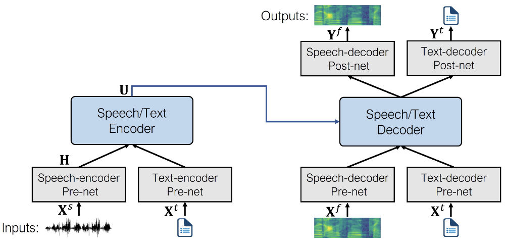
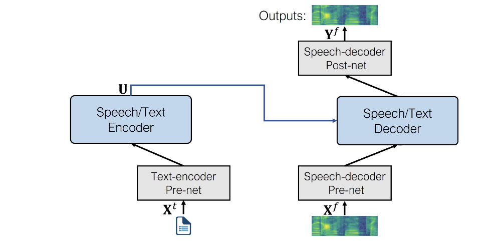

# **文本到语音的预训练模型** 

与 ASR（自动语音识别）和音频分类任务相比，可用的预训练模型检查点要少得多。在 🤗 Hub 上，您可以找到近 300 个合适的检查点。在这些预训练模型中，我们将重点关注 🤗 `Transformers` 库中的两种架构--SpeechT5 和 Massive Multilingual Speech (MMS)。在本节中，我们将探讨如何在 `Transformers` 库中使用这些预训练模型进行 TTS。

## **SpeechT5** 

[SpeechT5](https://arxiv.org/abs/2110.07205)是微软公司的敖君逸等人发布的模型，能够处理一系列语音任务。在本单元中，我们将重点放在文本到语音方面，但该模型既可用于语音到文本任务（自动语音识别或说话人识别），也可用于语音到语音任务（如语音增强或不同语音之间的转换）。这要归功于模型的设计和预训练方式。

SpeechT5 的核心是一个普通的Transformer编码器-解码器模型。就像其他Transformer一样，编码器-解码器网络使用隐藏表示法对序列-序列变换进行建模。SpeechT5 支持的所有任务都采用相同的Transformer骨干。

该Transformer还辅以六个特定模态（语音/文本）*前置网络*和*后置网络*。输入的语音或文本（取决于任务）通过相应的前置网络进行预处理，以获得 Transformer 可以使用的隐藏表征。然后，Transformer的输出被传递给后置网络，后者将利用Transformer的输出生成目标模态的输出。

这就是该架构的外观（图片来自原始论文）：



SpeechT5 首先使用大规模无标记语音和文本数据进行预训练，以获得不同模态的统一表示。在预训练阶段，所有前置网络和后置网络同时使用。

预训练完成后，整个编码器-解码器骨干网络将针对每个任务进行微调。在这一步中，只使用与特定任务相关的前置网络和后置网络。例如，要使用 SpeechT5 进行文本到语音的转换，就需要文本编码器前置网络来处理文本输入，语音解码器前置网络和后置网络来处理语音输出。

这种方法可以获得多个针对不同语音任务进行微调的模型，这些模型都受益于在无标记数据上进行的初始预训练。

> 尽管微调后的模型一开始使用的是来自共享预训练模型的同一组权重，但最终的版本却大相径庭。例如，您无法使用微调后的 ASR 模型，然后将前置网络和后置网络互换，以获得一个有效的 TTS 模型。SpeechT5 是灵活的，但不是那么灵活；)

让我们来看看 SpeechT5 具体用于 TTS 任务的前置网和后置网有哪些：

- 文本编码器前置网络： 文本嵌入将文本token映射到编码器所期望的隐藏表示。这与 BERT 等 NLP 模型中的情况类似。
- 语音解码器前置网络： 它将对数梅尔频谱图作为输入，并使用一系列线性层将频谱图压缩为隐藏表征。
- 语音解码器后置网络： 后置网络预测输出频谱图的残差，并用于完善结果。

结合起来，这就是用于文本到语音的 SpeechT5 架构：



如您所见，输出是一个对数梅尔图，而不是最终波形。如果您还记得，我们在[第三单元](chapter3/refresher_on_transformer_models.md)中简要讨论过这个话题。生成音频的模型通常会产生一个对数梅尔频谱图，需要通过一个额外的神经网络（称为声码器）将其转换为波形。

让我们来看看如何做到这一点。

首先，让我们从 🤗 Hub 中加载经过微调的 TTS SpeechT5 模型，以及用于标记化和特征提取的处理器对象：

```python
from transformers import SpeechT5Processor, SpeechT5ForTextToSpeech

processor = SpeechT5Processor.from_pretrained("microsoft/speecht5_tts") 
model = SpeechT5ForTextToSpeech.from_pretrained("microsoft/speecht5_tts")
```

接下来，对输入文本进行标记化。

```python
inputs = processor(text="Don't count the days, make the days count.", return_tensors="pt")
```

SpeechT5 TTS 模型并不局限于为单个说话者创建语音。相反，它使用所谓的扬声器嵌入来捕捉特定扬声器的语音特征。

> 说话者嵌入是一种以紧凑的方式表示说话者身份的方法，它是一个固定大小的向量，与语句的长度无关。这些嵌入可以捕捉到说话者的声音、口音、语调以及其他区别于其他说话者的独特特征的基本信息。这种嵌入可用于扬声器验证、扬声器日记化、扬声器识别等。生成说话者嵌入的最常见技术包括
>
> - I-向量（身份向量）： I-Vectors 基于高斯混合模型 (GMM)。它们将扬声器表示为低维定长向量，这些向量来自扬声器特定 GMM 的统计量，并以无监督方式获得。
> - X 向量： X 向量使用深度神经网络 (DNN) 得出，通过结合时间上下文来捕捉帧级说话者信息。
>
> 与 I-Vectors 相比，[X-Vectors](https://www.danielpovey.com/files/2018_icassp_xvectors.pdf)是一种最先进的方法，在评估数据集上显示出更优越的性能。深度神经网络用于获取 X 向量：它通过训练来区分不同的说话人，并将可变长度的语音映射到固定维度的嵌入。您也可以加载提前计算好的 X 向量说话者嵌入，它将囊括特定说话者的说话特征。

让我们从 Hub 上的一个数据集中加载这样一个说话者嵌入。我们使用[此脚本](https://huggingface.co/mechanicalsea/speecht5-vc/blob/main/manifest/utils/prep_cmu_arctic_spkemb.py)从[CMU ARCTIC 数据集中](http://www.festvox.org/cmu_arctic/)获取了嵌入，但任何 X-Vector 嵌入都可以使用。

```python
from datasets import load_dataset 
embeddings_dataset = load_dataset("Matthijs/cmu-arctic-xvectors", split="validation") import torch 
speaker_embeddings = torch.tensor(embeddings_dataset[7306]["xvector"]).unsqueeze(0)
```

扬声器嵌入是一个形状为 (1, 512) 的张量。这个特定的扬声器嵌入描述了一个女声。

此时，我们已经有足够的输入来生成对数梅尔频谱图作为输出，你可以这样做：

```python
spectrogram = model.generate_speech(inputs["input_ids"], speaker_embeddings)
```

这将输出一个形状为 (140, 80) 的张量，其中包含一个对数梅尔频谱图。第一个维度是序列长度，由于语音解码器前置网络总是对输入序列进行滤波，因此序列长度在不同的运行中可能会有所不同。这就给生成的语音增加了一些随机变化。

不过，如果我们要生成语音波形，就需要指定一个声码器，用于从频谱图到波形的转换。理论上，您可以使用任何可用于 80 分贝梅尔频谱图的声码器。方便的是，🤗 `Transformers` 提供了基于 HiFi-GAN 的声码器。其权重由 SpeechT5 的原作者友情提供。

> [HiFi-GAN](https://arxiv.org/pdf/2010.05646v2.pdf)是最先进的生成对抗网络 (GAN)，专为高保真语音合成而设计。它能从频谱图输入生成高质量、逼真的音频波形。从高层来看，HiFi-GAN 由一个生成器和两个判别器组成。生成器是一个全卷积神经网络，它将 Mel 频谱图作为输入，并学习生成原始音频波形。鉴别器的作用是区分真实音频和生成音频。两个鉴别器关注音频的不同方面。
>
> HiFi-GAN 是在高质量音频录音的大型数据集上进行训练的。它采用所谓的*对抗训练*，即生成器网络和鉴别器网络相互竞争。起初，生成器会生成低质量的音频，而鉴别器可以很容易地将其与真实音频区分开来。随着训练的进行，生成器会改进其输出，以骗过鉴别器。反过来，鉴别器也能更准确地区分真实音频和生成音频。随着时间的推移，这种对抗性反馈循环有助于两个网络的改进。最终，HiFi-GAN 可以学会生成与训练数据特征非常相似的高保真音频。

加载声码器与加载其他 🤗 `Transformers` 模型一样简单。

```python
from transformers import SpeechT5HifiGan 

vocoder = SpeechT5HifiGan.from_pretrained("microsoft/speecht5_hifigan")
```

现在只需在生成语音时将其作为参数传递，输出就会自动转换为语音波形。

```python
speech = model.generate_speech(inputs["input_ids"], speaker_embeddings, vocoder=vocoder)
```

让我们听听结果。SpeechT5 使用的采样率始终是 16 kHz。

```python
from IPython.display import Audio 

Audio(speech, rate=16000)
```

真不错！

请随意使用 SpeechT5 文本到语音演示，探索其他语音，尝试输入。请注意，这个预训练检查点仅支持英语。

## **Bark** 

Bark 是Suno AI 在 [suno-ai/bark](https://github.com/suno-ai/bark) 中提出的基于Transformer的文本到语音模型。

与 SpeechT5 不同的是，Bark 直接生成原始语音波形，无需在推理过程中使用单独的声码器--它已经集成了声码器。这种效率是通过使用 [`Encodec`](https://huggingface.co/docs/transformers/main/en/model_doc/encodec) 实现的，它既是编解码器，也是压缩工具。

有了 `Encodec`，你可以将音频压缩成轻量级格式，以减少内存使用，然后再解压缩以恢复原始音频。这一压缩过程由 8 个编码本提供便利，每个编码本都由整数向量组成。可以将这些编码本视为音频的整数形式表示或嵌入。值得注意的是，每一个连续的编码本都会提高从之前的编码本重建音频的质量。由于编码本是整数向量，因此可以通过 Transformer 模型来学习，而 Transformer 模型在这项任务中非常高效。这正是 Bark 经过专门训练后要做的事情。

具体来说，Bark 由 4 个主要模型组成： 

- `BarkSemanticModel` 模型（也称为 "文本 "模型）：这是一个因果自回归变换器模型，它将标记化文本作为输入，并预测能够捕捉文本含义的语义文本标记。
- `BarkCoarseModel`（也称为 "粗声学 "模型）：这是一个因果自回归变换模型，将 `BarkSemanticModel` 模型的结果作为输入。其目的是预测 EnCodec 所需的前两个音频编码本。
- `BarkFineModel`（"精细声学 "模型），这一次是一个非因果自编码 Transformer ，它根据前一个编码本嵌入的总和迭代预测最后一个编码本。
- 从 `EncodecModel` 中预测出所有编码本通道后，Bark 将其用于解码输出音频阵列。

值得注意的是，前三个模块中的每一个都可以支持有条件的扬声器嵌入，以根据特定的预定义语音对输出声音进行调节。

Bark 是一种高度可控的文本到语音模型，这意味着你可以使用不同的设置，正如我们将要看到的那样。

首先，加载模型及其处理器。

处理器的作用是双重的：

1. 它用于对输入文本进行标记化，即把文本切成模型可以理解的小块。
2. 它存储说话者嵌入，即可以作为生成条件的语音预设。

```python
from transformers import BarkModel, BarkProcessor 

model = BarkModel.from_pretrained("suno/bark-small") 
processor = BarkProcessor.from_pretrained("suno/bark-small")
```

Bark 非常灵活，可以通过处理器加载的[ `speaker embedding` 库](https://suno-ai.notion.site/8b8e8749ed514b0cbf3f699013548683?v=bc67cff786b04b50b3ceb756fd05f68c)生成音频。

```python
# 添加扬声器嵌入
inputs = processor("This is a test!", voice_preset="v2/en_speaker_3")

speech_output = model.generate(**inputs).cpu().numpy()
```

它还能生成即用型多语言语音，如法语和中文。你可以[在这里](https://huggingface.co/suno/bark)找到支持的语言列表。与下文讨论的MMS不同，它无需指定使用的语言，只需将输入文本调整为相应的语言即可。

```python
# 在法语中试用，让我们也添加一个法语发言人嵌入
inputs = processor("C'est un test!", voice_preset="v2/fr_speaker_1") 

speech_output = model.generate(**inputs).cpu().numpy()
```

该模型还能生成***\*非语言交流\****，如大笑、叹息和哭泣。您只需用相应的提示语修改输入文本，如`[clear thorat]`、`[laughter]` 或`....`

```python
inputs = processor(
	"[clears throat] This is a test ... and I just took a long pause.", 		    voice_preset="v2/fr_speaker_1", ) 
	
speech_output = model.generate(**inputs).cpu().numpy()
```

Bark 甚至可以生成音乐。你可以在你的话语周围添加音符。

```python
inputs = processor(
	"♪ In the mighty jungle, I'm trying to generate barks.", 
) 

speech_output = model.generate(**inputs).cpu().numpy()
```

除了所有这些功能外，Bark 还支持批处理，这意味着你可以同时处理多个文本条目，但代价是需要进行更密集的计算。在某些硬件（如 GPU）上，批处理可以加快整体生成速度，这意味着一次生成所有样本比逐个生成样本更快。

让我们试着生成几个示例：

```python
input_list = [ 
	"[clears throat] Hello uh ...，my dog is cute [laughter]", 
	"Let's try generating speech, with Bark, a text-to-speech model", 
	"♪ In the jungle, the mighty jungle, the lion barks tonight ♪", 
]  
# 还添加了扬声器嵌入
inputs = processor(input_list, voice_preset="v2/en_speaker_3") 

speech_output = model.generate(**inputs).cpu().numpy()
```

让我们逐一听听输出结果。

第一个

```python
from IPython.display import Audio 

sampling_rate = model.generation_config.sample_rate 
Audio(speech_output[0], rate=sampling_rate)
```

第二个

```python
Audio(speech_output[1], rate=sampling_rate)
```

第三个

```python
Audio(speech_output[2], rate=sampling_rate)
```

>  Bark 和其他 🤗 Transformer 模型一样，只需几行代码就能对速度和内存影响进行优化。要了解如何优化，请单击[此colab演示笔记本](https://colab.research.google.com/github/ylacombe/notebooks/blob/main/Benchmark_Bark_HuggingFace.ipynb)。

## **大规模多语言语音 (MMS)** 

如果您正在寻找英语以外语言的预训练模型，该怎么办？大规模多语言语音 (MMS) 是另一种涵盖一系列语音任务的模型，但它支持大量语言。例如，它可以合成 1100 多种语言的语音。

用于文本到语音的 MMS 基于[VITS](https://arxiv.org/pdf/2106.06103.pdf)，它是最先进的 TTS 方法之一。

VITS 是一种语音生成网络，可将文本转换为原始语音波形。它的工作原理类似于条件式变换自编码机，从输入文本中估计音频特征。首先，生成以频谱图表示的声音特征。然后，使用从 HiFi-GAN 改编而来的转置卷积层对波形进行解码。在推理过程中，使用流模块和 HiFiGAN 解码器对文本编码进行上采样并转换成波形。与 Bark 一样，不需要声码器，因为波形是直接生成的。

>  MMS 模型最近才添加到 🤗 Transformers 中，因此您必须从源代码安装该库：
>
> ```
> pip install git+https://github.com/huggingface/transformers.git
> ```

让我们试一试 MMS，看看如何用英语以外的语言（如德语）合成语音。首先，我们要为正确的语言加载模型检查点和标记器：

```python
from transformers import VitsModel, VitsTokenizer 

model = VitsModel.from_pretrained("facebook/mms-tts-deu") 
tokenizer = VitsTokenizer.from_pretrained("facebook/mms-tts-deu")
```

您可能会注意到，要加载 MMS 模型，需要使用 `VitsModel` 和 `VitsTokenizer` 。这是因为文本到语音的 MMS 是基于前面提到的 VITS 模型。

让我们选取一个德语文本示例，比如一首儿歌的前两行：

```python
text_example = (
	"Ich bin Schnappi das kleine Krokodil, komm aus Ägypten das liegt direkt am Nil."
)
```

要生成波形输出，请使用 tokenizer 对文本进行预处理，然后将其传递给模型：

```python
import torch 

inputs = tokenizer(text_example, return_tensors="pt") 
input_ids = inputs["input_ids"] 

with torch.no_grad(): 
	outputs = model(input_ids) 
	
speech = outputs["waveform"]
```

让我们来听一听：

```python
from IPython.display import Audio 

Audio(speech, rate=16000)
```

太棒了！如果您想尝试使用其他语言MMS，请在 [🤗 Hub]((https://huggingface.co/models?filter=vits)) 上查找其他合适的 `vits` 检查点。

现在，让我们看看如何自行微调 TTS 模型！
