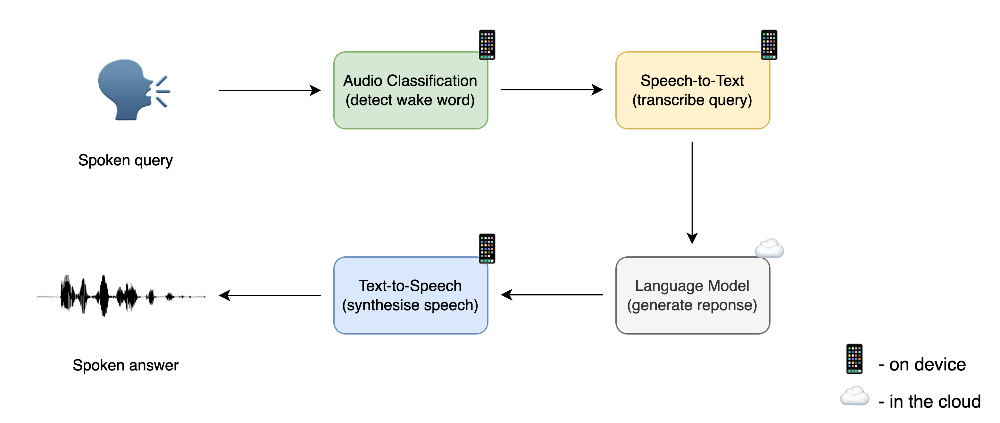
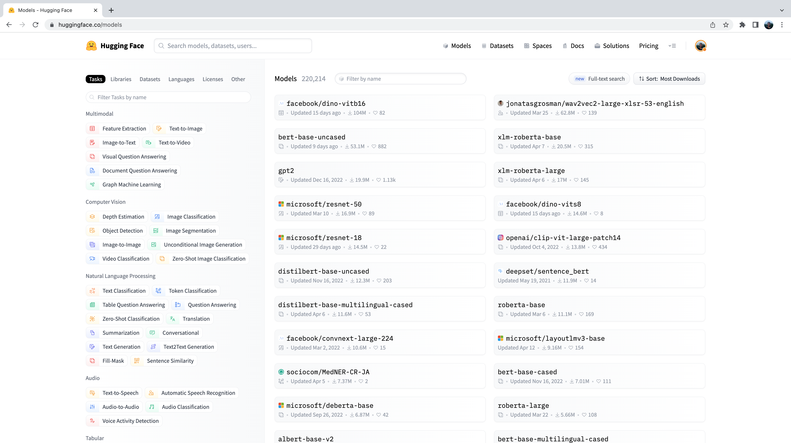
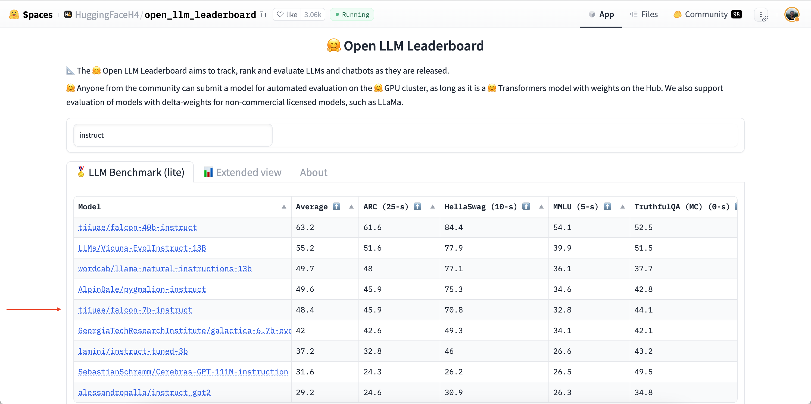
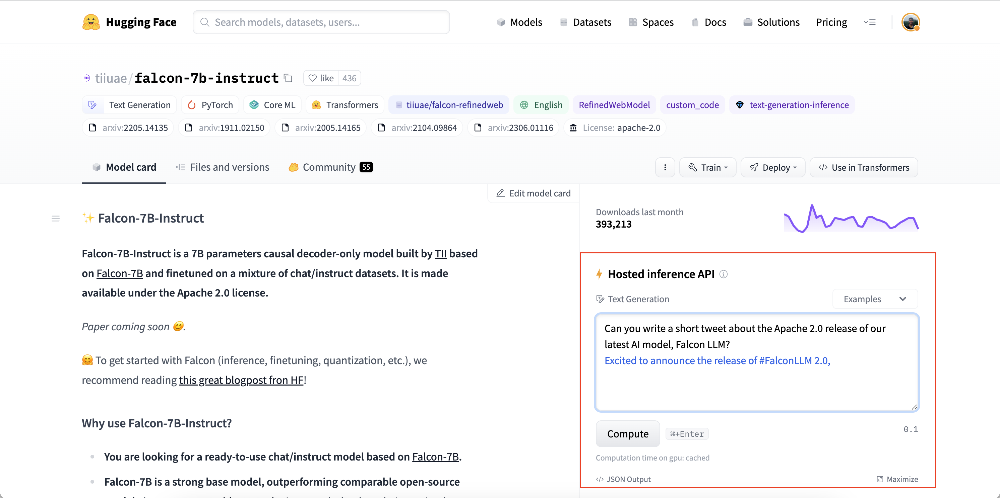

# 创建语音助手

在本节中，我们将把已经亲身体验过的三种模型组合在一起，构建一个名为 **Marvin**🤖 的端到端语音助手。与亚马逊的 Alexa 或苹果的 Siri 一样，Marvin 也是一个虚拟语音助手，它会对特定的 "唤醒词 "做出响应，然后聆听语音询问，最后做出语音回答。

我们可以将语音助手的流程分为四个阶段，每个阶段都需要一个独立的模型：



## **1.** **唤醒词检测** 

语音助手会持续监听通过设备麦克风输入的音频，但只有在特定的"唤醒词"或 "触发词"被说出时，语音助手才会启动。

唤醒词检测任务由一个小型的设备上音频分类模型处理，该模型比语音识别模型小得多、轻得多，通常只有几百万个参数，而语音识别则需要几亿个参数。因此，它可以在设备上持续运行，而不会耗尽电池。只有在检测到唤醒词时，才会启动更大的语音识别模型，之后再关闭。

## **2.** **语音转录** 

下一阶段是将语音询问转录为文本。实际上，由于音频文件较大，将音频文件从本地设备传输到云端的速度很慢，因此直接使用设备上的自动语音识别（ASR）模型进行转录比使用云端的模型更有效。设备上的模型可能会比云上的模型小一些，因此准确度也会低一些，但推理速度更快，这也是值得的，因为我们可以近乎实时地运行语音识别，在我们说话的同时转录我们的语音。

我们现在对语音识别过程已经非常熟悉，所以这应该是小菜一碟！

## **3.** **语言模型查询** 

既然已经知道用户问了什么，我们就需要生成一个回复！这项任务的最佳候选模型是*大型语言模型（LLM）*，因为它们能够有效地理解文本查询的语义并生成合适的回复。

由于我们的文本查询很小（只有几个文本标记），而语言模型很大（有数十亿个参数），因此运行 LLM 推理的最有效方法是将我们的文本查询从设备发送到云中运行的 LLM，生成文本响应，然后将响应返回设备。

## **4.** **合成语音** 

最后，我们将使用文本到语音 (TTS) 模型将文本响应合成为语音。这项工作在设备上完成，但您也可以在云中运行 TTS 模型，生成音频输出并将其传输回设备。

同样，我们已经做过好几次这样的工作，所以过程会非常熟悉！

> 以下部分需要使用麦克风录制语音输入。由于谷歌 Colab 机器与麦克风不兼容，建议在本地运行此部分，可以在 CPU 上运行，如果有本地访问权限，也可以在 GPU 上运行。我们选择的检查点大小已经小到足以在 CPU 上快速运行，因此无需 GPU 也能获得良好的性能。

## **唤醒词检测** 

语音助手流水线的第一阶段是检测是否有人说了唤醒词，我们需要为这项任务找到合适的预训练模型！您应该还记得，在[音频分类预训练模型](chapter4/pre-trained_models_for_audio_classification.md)一节中，[Speech Commands](https://huggingface.co/datasets/speech_commands)是一个口语单词数据集，用于评估音频分类模型在 15 个以上简单命令单词（如`"up"`、 `"down"`、 `"yes"`和`"no"`）以及 `"silence"`标签（用于对无语音进行分类）上的表现。请在 Hub 上的数据集查看器中花一分钟听一下样本，重新熟悉一下语音命令数据集：[数据集查看器](https://huggingface.co/datasets/speech_commands/viewer/v0.01/train)。

我们可以使用在语音命令数据集上预先训练好的音频分类模型，从这些简单的命令词中挑选一个作为我们选择的唤醒词。在 15 个以上可能的命令词中，如果模型预测出我们选择的唤醒词的概率最高，那么我们就可以相当确定唤醒词已经说过了。

让我们前往 Hugging Face Hub，点击 "模型 "选项卡：[https://huggingface.co/models](https://huggingface.co/models)。

这将显示 Hugging Face Hub 上的所有模型，按过去 30 天的下载量排序：



您会发现在左侧有一系列选项卡，我们可以选择这些选项卡来按任务、库、数据集等过滤模型。向下滚动，从音频任务列表中选择 "音频分类"任务：


现在我们看到的是 Hub 上 500 多个音频分类模型的子集。要进一步完善这一选择，我们可以按数据集过滤模型。点击 "数据集 "标签，在搜索框中输入 "speech_commands"。开始输入时，您会看到搜索选项卡下方出现`speech_commands`选项。您可以单击此按钮，将所有音频分类模型过滤为在语音命令数据集上进行微调的模型：


太好了！我们可以看到，对于这个特定的数据集和任务，我们有六个预先训练好的模型可用（不过，如果您在以后阅读，可能会有新的模型加入！）。您一定能认出其中的第一个模型就是我们在第 4 单元示例中使用的[音频频谱图Transformer检查点](https://huggingface.co/MIT/ast-finetuned-speech-commands-v2)。我们将在唤醒词检测任务中再次使用这个检查点。

让我们继续使用`pipeline`类加载检查点：

```python
from transformers import pipeline
import torch

device = "cuda:0" if torch.cuda.is_available() else "cpu"

classifier = pipeline(
    "audio-classification", model="MIT/ast-finetuned-speech-commands-v2", device=device
)
```

我们可以通过检查模型配置中的`id2label`属性来查看模型是在哪些标签上训练的：

```python
classifier.model.config.id2label
```

好了！我们可以看到，模型是在 35 个类标签上训练的，其中包括我们上面描述的一些简单指令词，以及一些特定对象，如`"bed"`、 `"house"`和`"cat"。`我们看到这些类标签中有一个名字：id 27 对应的标签是**"marvin"**: 

```python
classifier.model.config.id2label[27]
```

```python
'marvin'
```

完美！我们可以用这个名字作为语音助手的唤醒词，就像亚马逊的 Alexa 使用 "Alexa"，苹果的 Siri 使用 "Hey Siri "一样。在所有可能的标签中，如果模型以最高的类概率预测出 "marvin"，那么我们就可以相当肯定，我们选择的唤醒词已经说过了。

现在，我们需要定义一个函数，持续监听设备的麦克风输入，并不断将音频传递给分类模型进行推理。为此，我们将使用 🤗 `Transformers` 自带的名为 [`ffmpeg_microphone_live`](https://github.com/huggingface/transformers/blob/fb78769b9c053876ed7ae152ee995b0439a4462a/src/transformers/pipelines/audio_utils.py#L98) 的便捷辅助函数。

该函数将指定长度 `chunk_length_s` 的小块音频转发给模型进行分类。为了确保各音频块之间的边界平滑，我们在音频上运行了一个滑动窗口，步长为 `chunk_length_s` / 6。 为了避免在开始推断之前等待整个第一音频块录制完毕，我们还定义了一个最小的临时音频输入长度 `stream_chunk_s`，在达到 `chunk_length_s` 时间之前转发给模型。

函数 `ffmpeg_microphone_live` 会返回一个 `generator` 对象，生成的音频块序列可以分别传递给分类模型以进行预测。我们可以直接将生成器传递给流水线，流水线会返回一系列输出预测，每块音频输入都有一个预测。我们可以检查每个音频块的类标签概率，并在检测到唤醒词已被说出时停止唤醒词检测循环。

我们将使用一个非常简单的标准来分类唤醒词是否已被说出：如果概率最高的类标签是唤醒词，并且该概率超过了阈值 `prob_threshold`，我们就宣布唤醒词已被说出。这样使用概率阈值对分类器进行把关，可以确保在音频输入是噪音的情况下，不会错误地预测出唤醒词，而这通常是在模型非常不确定、所有类标签概率都很低的情况下。您可能需要调整这个概率阈值，或通过基于[熵](https://en.wikipedia.org/wiki/Entropy_(information_theory))（或不确定性）的指标来探索更复杂的唤醒词判断方法。

```python
from transformers.pipelines.audio_utils import ffmpeg_microphone_live


def launch_fn(
    wake_word="marvin",
    prob_threshold=0.5,
    chunk_length_s=2.0,
    stream_chunk_s=0.25,
    debug=False,
):
    if wake_word not in classifier.model.config.label2id.keys():
        raise ValueError(
            f"Wake word {wake_word} not in set of valid class labels, pick a wake word in the set {classifier.model.config.label2id.keys()}."
        )

    sampling_rate = classifier.feature_extractor.sampling_rate

    mic = ffmpeg_microphone_live(
        sampling_rate=sampling_rate,
        chunk_length_s=chunk_length_s,
        stream_chunk_s=stream_chunk_s,
    )

    print("Listening for wake word...")
    for prediction in classifier(mic):
        prediction = prediction[0]
        if debug:
            print(prediction)
        if prediction["label"] == wake_word:
            if prediction["score"] > prob_threshold:
                return True
```

让我们试一下这个函数，看看它是如何工作的！我们将设置 `debug=True` 标志，以打印出每段音频的预测结果。让模型运行几秒钟，看看它在没有语音输入时的预测结果，然后清楚地说出唤醒词 "marvin"，观察 "marvin"的类标签预测结果是否飙升至接近 1：

```python
launch_fn(debug=True)
```

```python
Listening for wake word...
{'score': 0.055326107889413834, 'label': 'one'}
{'score': 0.05999856814742088, 'label': 'off'}
{'score': 0.1282748430967331, 'label': 'five'}
{'score': 0.07310110330581665, 'label': 'follow'}
{'score': 0.06634809821844101, 'label': 'follow'}
{'score': 0.05992642417550087, 'label': 'tree'}
{'score': 0.05992642417550087, 'label': 'tree'}
{'score': 0.999913215637207, 'label': 'marvin'}
```

真棒！正如我们所预期的那样，该模型在最初的几秒钟内生成了垃圾预测。由于没有语音输入，所以模型的预测接近随机，但概率非常低。一旦我们说出唤醒词，模型就会以接近 1 的概率预测出 "marvin"，并终止循环，这表明唤醒词已被检测到，ASR 系统应被激活！

## 语音转录

我们将在语音转录系统中再次使用 Whisper 模型。具体来说，我们将加载 [Whisper Base 英语](https://huggingface.co/openai/whisper-base.en)检查点，因为它足够小，可以提供良好的推理速度和合理的转录准确性。我们将使用一个小技巧，通过巧妙地将音频输入转发给模型，获得接近实时的转录效果。和以前一样，你可以随意使用 [Hub](https://huggingface.co/models?pipeline_tag=automatic-speech-recognition&library=transformers&sort=trending) 上的任何语音识别检查点，包括 Wav2Vec2、MMS ASR 或其他 Whisper 检查点：

```python
transcriber = pipeline(
    "automatic-speech-recognition", model="openai/whisper-base.en", device=device
)
```

> 如果您使用的是 GPU，您可以增加检查点的大小，以使用 [Whisper Small English](https://huggingface.co/openai/whisper-small.en) 检查点，它将返回更好的转录准确性，并且仍在所需的延迟阈值范围内。只需将模型 id 换成 `"openai/whisper-small.en"`。

现在，我们可以定义一个函数来记录麦克风输入并转录相应的文本。通过 `ffmpeg_microphone_live` 辅助函数，我们可以控制语音识别模型的"实时"程度。使用较小的 `stream_chunk_s`，可以提高语音识别的实时性，因为我们可以将输入音频分成较小的音频块，并即时转录。不过，这样做的代价是准确率较低，因为可供模型推断的上下文较少。

在转录语音时，我们还需要知道用户何时**停止**说话，以便终止录音。为简单起见，我们将在第一个 `chunk_length_s`（默认设置为 5 秒）后终止麦克风录音，但您也可以尝试使用语音活性检测 (VAD) 模型来预测用户何时停止说话。

```python
import sys


def transcribe(chunk_length_s=5.0, stream_chunk_s=1.0):
    sampling_rate = transcriber.feature_extractor.sampling_rate

    mic = ffmpeg_microphone_live(
        sampling_rate=sampling_rate,
        chunk_length_s=chunk_length_s,
        stream_chunk_s=stream_chunk_s,
    )

    print("Start speaking...")
    for item in transcriber(mic, generate_kwargs={"max_new_tokens": 128}):
        sys.stdout.write("\033[K")
        print(item["text"], end="\r")
        if not item["partial"][0]:
            break

    return item["text"]
```

让我们试一试，看看效果如何！麦克风启动后，开始讲话，然后观看您的转录以半实时方式显示：

```python
transcribe()
```

```python
Start speaking...
 Hey, this is a test with the whisper model.
```

不错！您可以根据您说话的快慢来调整最大音频长度 `chunk_length_s`（如果您觉得没有足够的时间说话，就增加它；如果您在结束时还在等待，就减少它），并调整实时因素 `stream_chunk_s`。只需将这些参数传递给转录函数即可。

## 语言模型查询

现在我们已经转录了口语查询，我们希望生成一个有意义的回复。为此，我们将使用云上托管的 LLM。具体来说，我们将在 Hugging Face Hub 上选择一个 LLM，并使用[推理 API](https://huggingface.co/inference-api/serverless)轻松查询该模型。

首先，让我们前往拥抱脸枢纽。为了找到我们的 LLM，我们将使用[🤗 Open LLM Leaderboard](https://huggingface.co/spaces/HuggingFaceH4/open_llm_leaderboard)，这是一个根据四个生成任务的性能对 LLM 模型进行排名的空间。我们将通过 "instruct"进行搜索，以筛选出经过指令微调的模型，因为这些模型应该更适合我们的查询任务：



我们将使用 [TII](https://www.tii.ae/) 的 [tiiuae/falcon-7b-instruct](https://huggingface.co/tiiuae/falcon-7b-instruct) 检查点，它是一个仅 7B 参数解码器的 LM，在聊天和指令数据集的混合基础上进行了微调。你可以使用 Hugging Face Hub 上任何启用了 "托管推理 API"的 LLM，只需留意模型卡右侧的小工具即可：



推理 API 允许我们从本地计算机向托管在 Hub 上的 LLM 发送 HTTP 请求，并以 `json` 文件形式返回响应。我们只需提供 Hugging Face Hub 令牌（直接从 Hugging Face Hub 文件夹中获取）和要查询的 LLM 的模型 ID：

```python
from huggingface_hub import HfFolder
import requests


def query(text, model_id="tiiuae/falcon-7b-instruct"):
    api_url = f"https://api-inference.huggingface.co/models/{model_id}"
    headers = {"Authorization": f"Bearer {HfFolder().get_token()}"}
    payload = {"inputs": text}

    print(f"Querying...: {text}")
    response = requests.post(api_url, headers=headers, json=payload)
    return response.json()[0]["generated_text"][len(text) + 1 :]
```

让我们用测试输入试试看！

```python
query("What does Hugging Face do?")
```

```python
'Hugging Face is a company that provides natural language processing and machine learning tools for developers. They'
```

你会发现使用推理 API 进行推理的速度非常快--我们只需从本地机器向托管模型发送少量文本令牌，因此通信成本非常低。LLM 由 GPU 加速器托管，因此推理运行速度非常快。最后，生成的响应将从模型传回我们的本地机器，通信开销同样很低。

## 合成语音

现在，我们准备获取最终的语音输出！我们将再次使用 [Microsoft SpeechT5 TTS](https://huggingface.co/microsoft/speecht5_tts) 模型进行英语 TTS，但您也可以选择任何 TTS 模型。让我们继续加载处理器和模型：

```python
from transformers import SpeechT5Processor, SpeechT5ForTextToSpeech, SpeechT5HifiGan

processor = SpeechT5Processor.from_pretrained("microsoft/speecht5_tts")

model = SpeechT5ForTextToSpeech.from_pretrained("microsoft/speecht5_tts").to(device)
vocoder = SpeechT5HifiGan.from_pretrained("microsoft/speecht5_hifigan").to(device)
```

还有说话人嵌入：

```python
from datasets import load_dataset

embeddings_dataset = load_dataset("Matthijs/cmu-arctic-xvectors", split="validation")
speaker_embeddings = torch.tensor(embeddings_dataset[7306]["xvector"]).unsqueeze(0)
```

我们将重新使用在上一章 ["语音-语音翻译"](chapter7/speech_to_speech_translation.md)中定义的`synthesise`函数：

```python
def synthesise(text):
    inputs = processor(text=text, return_tensors="pt")
    speech = model.generate_speech(
        inputs["input_ids"].to(device), speaker_embeddings.to(device), vocoder=vocoder
    )
    return speech.cpu()
```

让我们快速验证一下它是否能正常工作：

```python
from IPython.display import Audio

audio = synthesise(
    "Hugging Face is a company that provides natural language processing and machine learning tools for developers."
)

Audio(audio, rate=16000)
```

干得漂亮 👍

## Marvin 🤖

现在，我们已经为语音助手流水线的四个阶段分别定义了一个函数，剩下要做的就是将它们拼接在一起，得到端到端的语音助手。我们只需将这四个阶段串联起来，从唤醒词检测 (`launch_fn`)、语音转录、查询 LLM 到最后的语音合成。

```python
launch_fn()
transcription = transcribe()
response = query(transcription)
audio = synthesise(response)

Audio(audio, rate=16000, autoplay=True)
```

用一些提示试一试！下面是一些例子，供您参考：

- *What is the hottest country in the world?*
- *How do Transformer models work?*
- *Do you know Spanish?*

就这样，我们的端到端语音助手就完成了，它使用了您在本课程中学到的 🤗 音频工具，并在最后加入了 LLM 魔法。我们可以做一些扩展来改进语音助手。首先，音频分类模型可对 35 种不同的标签进行分类。我们可以使用一个更小、更轻量级的二进制分类模型，只预测是否说出了唤醒词。其次，我们预先加载了所有模型，并让它们在设备上运行。如果我们想节省电量，就只能在需要时加载每个模型，之后再卸载。第三，我们的转录功能中缺少语音活动检测模型，转录的时间是固定的，在某些情况下太长，而在另一些情况下则太短。

## 泛化到任何情况 🪄

到目前为止，我们已经了解了如何使用语音助手 Marvin 生成语音输出。最后，我们将演示如何将这些语音输出泛化为文本、音频和图像。

我们将使用 [Transformers Agents](https://huggingface.co/docs/transformers/transformers_agents) 来构建我们的助手。Transformers Agents 在 🤗 Transformers 和 Diffusers 库的基础上提供了一个自然语言 API，使用 LLM 和精心制作的提示来解释自然语言输入，并使用一系列精心策划的工具来提供多模态输出。

让我们继续实例化一个代理。有[三种 LLM](https://huggingface.co/docs/transformers/transformers_agents#quickstart) 可用于 Transformers Agents，其中两种在 Hugging Face Hub 上开源且免费。第三个是 OpenAI 提供的模型，需要 OpenAI API 密钥。我们将在本例中使用免费的 [Bigcode Starcoder](https://huggingface.co/bigcode/starcoder) 模型，但你也可以试试其他可用的 LLM：

```python
from transformers import HfAgent

agent = HfAgent(
    url_endpoint="https://api-inference.huggingface.co/models/bigcode/starcoder"
)
```

要使用代理，我们只需用文本提示调用` agent.run`。例如，我们将让它生成一张猫的图片🐈（希望比这个表情符号好看一些）：

```python
agent.run("Generate an image of a cat")
```


> 请注意，第一次调用时会触发模型权重的下载，这可能需要一些时间，具体取决于 Hub 的下载速度。

就这么简单！代理解释了我们的提示，并在表面下使用[Stable Diffusion](https://huggingface.co/docs/diffusers/using-diffusers/conditional_image_generation)生成图像，我们无需担心加载模型、编写函数或执行代码。

现在，我们可以用语音助手中的 Transformers Agent 代替 LLM 查询函数和文本合成步骤，因为 Agent 将为我们处理这两个步骤：

```python
launch_fn()
transcription = transcribe()
agent.run(transcription)
```

试着说出同样的提示 "Generate an image of a cat"，看看系统的反应如何。如果您向代理提出一个简单的问/答问题，代理将以文本回答。您可以要求它返回图像或语音，鼓励它生成多模态输出。例如，您可以要求它 "Generate an image of a cat, caption it, and speak the caption"。

虽然代理比我们的第一个迭代 Marivin 🤖助手更加灵活，但以这种方式概括语音助手任务可能会导致标准语音助手查询的性能下降。为了恢复性能，你可以尝试使用性能更强的 LLM 检查点，比如 OpenAI 的检查点，或者定义一套专门针对语音助手任务的[自定义工具](https://huggingface.co/docs/transformers/transformers_agents#custom-tools)。
