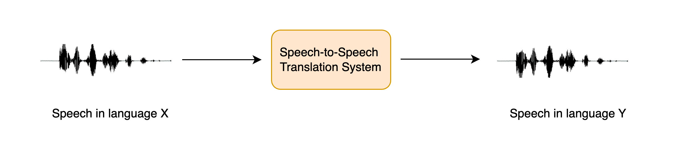
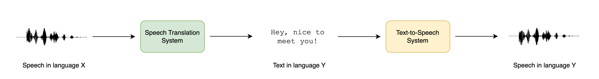

# 语音-语音翻译

语音到语音翻译（STST 或 S2ST）是一项相对较新的口语处理任务。它涉及将一种语言的语音翻译成另一种语言的语音：



STST 可视为传统机器翻译（MT）任务的延伸：我们不是将**文字**从一种语言翻译成另一种语言，而是将**语音**从一种语言翻译成另一种语言。STST 可应用于多语言交流领域，让不同语言的使用者通过语音媒介进行交流。

假设您想跨越语言障碍与他人交流。你可以直接说出来，然后让 STST 系统将你的语音转换成目标语言，而不是先把你想传达的信息写出来，然后再翻译成目标语言的文本。然后，收件人可以通过 STST 系统回话，而您则可以聆听他们的回应。与基于文本的机器翻译相比，这种交流方式更为自然。

在本章中，我们将探讨 STST 的*级联*方法，将您在课程第 5 和第 6 单元中学到的知识拼凑在一起。我们将使用*语音翻译 (ST)* 系统将源语音转录为目标语言文本，然后使用文本到语音 (TTS) 从翻译文本生成目标语言语音：



我们也可以采用三阶段方法，即首先使用自动语音识别 (ASR) 系统将源语音转录为相同语言的文本，然后使用机器翻译将转录文本翻译为目标语言，最后使用文本到语音技术生成目标语言的语音。然而，在流水线中添加更多组件会导致*错误传播*，即在一个系统中引入的错误在流经其余系统时会变得更加复杂，同时也会增加延迟，因为需要对更多模型进行推理。

虽然 STST 的这种级联方法非常简单，但却能产生非常有效的 STST 系统。ASR + MT + TTS 三级级联系统曾被用于支持许多商业 STST 产品，包括[谷歌翻译](https://blog.research.google/2019/05/introducing-translatotron-end-to-end.html)。这也是开发 STST 系统的一种非常高效的数据和计算方式，因为现有的语音识别和文本到语音系统可以耦合在一起，生成一个新的 STST 模型，而无需任何额外的训练。

在本单元的其余部分，我们将重点讨论如何创建一个 STST 系统，将任何语言 X 的语音翻译成英语语音。所涉及的方法可以扩展到将任何语言 X 翻译成任何语言 Y 的 STST 系统，但我们将把这一扩展留给读者，并在适用的地方提供指针。我们将 STST 任务进一步划分为两个组成部分： ST 和 TTS。最后，我们将把它们拼凑在一起，制作一个 Gradio 演示来展示我们的系统。

## 语音翻译

我们的语音翻译系统将使用 Whisper 模型，因为它能够将超过 96 种语言翻译成英语。具体来说，我们将加载 [Whisper Base](https://huggingface.co/openai/whisper-base) 检查点，它的参数为 74M。这绝不是性能最好的 Whisper 模型，[最大的 Whisper 检查点](https://huggingface.co/openai/whisper-large-v2)比它大 20 多倍，但由于我们要将两个自回归系统（ST + TTS）整合在一起，因此我们要确保每个模型都能相对快速地生成，从而获得合理的推理速度：

```python
import torch
from transformers import pipeline

device = "cuda:0" if torch.cuda.is_available() else "cpu"
pipe = pipeline(
    "automatic-speech-recognition", model="openai/whisper-base", device=device
)
```

太好了！为了测试 STST 系统，我们将加载一个非英语的音频样本。让我们加载 [VoxPopuli](https://huggingface.co/datasets/facebook/voxpopuli) 数据集意大利语（it）分集的第一个示例：

```python
from datasets import load_dataset

dataset = load_dataset("facebook/voxpopuli", "it", split="validation", streaming=True)
sample = next(iter(dataset))
```


要收听这个样本，我们可以使用 Hub 上的数据集查看器播放：[facebook/voxpopuli/viewer](https://huggingface.co/datasets/facebook/voxpopuli/viewer/it/validation?row=0)

或使用 ipynb 音频功能播放：

```python
from IPython.display import Audio

Audio(sample["audio"]["array"], rate=sample["audio"]["sampling_rate"])
```

现在让我们定义一个函数，接收音频输入并返回翻译后的文本。你会记得，我们必须为`"task"`传递生成关键字参数，将其设置为`translate`，以确保 Whisper 执行的是语音翻译而不是语音识别：

```python
def translate(audio)：
    outputs = pipe(audio, max_new_tokens=256, generate_kwargs={"task": "translate"})
    return outputs["text"]
```

> 只需在生成关键字参数中将任务设置为 "transcribe"，并将 "language"设置为目标语言，例如，对于西班牙语，可以设置以下参数：`generate_kwargs={"task": "transcribe", "language": "es"}`

好极了！让我们快速检查一下模型是否得出了合理的结果：

```python
translate(sample["audio"].copy())
```

```
' psychological and social. I think that it is a very important step in the construction of a juridical space of freedom, circulation and protection of rights.'
```

好吧！如果我们将其与原文进行比较：
```python
sample["raw_text"]
```

```
'Penso che questo sia un passo in avanti importante nella costruzione di uno spazio giuridico di libertà di circolazione e di protezione dei diritti per le persone in Europa.'
```

我们可以看到，除了在转录的开头，说话者在结束上一句话时多说了几个字之外，译文大致吻合（你可以使用谷歌翻译进行复核）。

至此，我们完成了级联 STST 管道的前半部分，将第五单元中学习的如何使用 Whisper 模型进行语音识别和翻译的技能付诸实践。如果你想复习一下我们所涉及的任何步骤，请阅读第五单元中的 [ASR 预训练模型部分](chapter5/pre-trained_models_for_speech_recognition.md)。

## 文本到语音
级联 STST 系统的后半部分涉及从英文文本到英文语音的映射。为此，我们将使用预先训练好的 [SpeechT5 TTS](https://huggingface.co/microsoft/speecht5_tts) 模型进行英语 TTS。🤗 Transformers 目前没有 TTS 流水线，因此我们必须自己直接使用该模型。这没什么大不了的，你们都是在第 6 单元之后使用该模型进行推理的专家！

首先，让我们从预训练检查点加载 SpeechT5 处理器、模型和声码器：

```python
from transformers import SpeechT5Processor, SpeechT5ForTextToSpeech, SpeechT5HifiGan

processor = SpeechT5Processor.from_pretrained("microsoft/speecht5_tts")

model = SpeechT5ForTextToSpeech.from_pretrained("microsoft/speecht5_tts")
vocoder = SpeechT5HifiGan.from_pretrained("microsoft/speecht5_hifigan")
```

> 这里我们使用的是专门为英语 TTS 训练的 SpeechT5 检查点。如果您想翻译成英语以外的其他语言，可以将检查点换成根据您选择的语言微调过的 SpeechT5 TTS 模型，或者使用根据您的目标语言预先训练过的 MMS TTS 检查点。

与 Whisper 模型一样，如果有 GPU 加速设备，我们将把 SpeechT5 模型和声码器放在 GPU 加速设备上：

```python
model.to(device)
vocoder.to(device)
```

太好了，让我们加载说话人embeddings：

```python
embeddings_dataset = load_dataset("Matthijs/cmu-arctic-xvectors", split="validation")
speaker_embeddings = torch.tensor(embeddings_dataset[7306]["xvector"]).unsqueeze(0)
```

现在我们可以编写一个函数，将文本提示作为输入，并生成相应的语音。首先，我们将使用 SpeechT5 处理器对文本输入进行预处理，标记文本以获得输入 id。然后，我们会将输入 id 和说话人嵌入信息传递给 SpeechT5 模型，如果有加速设备，则将其放置在加速设备上。最后，我们将返回生成的语音，将其带回 CPU，以便在我们的 ipynb 笔记本中播放：

```python
def synthesise(text):
    inputs = processor(text=text, return_tensors="pt")
    speech = model.generate_speech(
        inputs["input_ids"].to(device), speaker_embeddings.to(device), vocoder=vocoder
    )
    return speech.cpu()
```

让我们用一个虚拟文本输入来检查它是否正常工作：

```python
speech = synthesise("Hey there! This is a test!")

Audio(speech, rate=16000)
```

听起来不错！现在是激动人心的部分--拼凑这一切。

## 创建 STST 演示

在创建 Gradio 演示来展示 STST 系统之前，让我们先做一个快速健全性检查，确保我们可以串联两个模型，即输入音频样本和输出音频样本。我们将通过串联前两个小节中定义的两个函数来实现这一点，即输入源音频并检索翻译文本，然后合成翻译文本以获得翻译语音。最后，我们将合成语音转换为 `int16` 数组，这是 Gradio 期望的输出音频文件格式。为此，我们首先要根据目标 dtype（`int16`）的动态范围对音频数组进行归一化，然后将 NumPy 的默认 dtype（`float64`）转换为目标 dtype（`int16`）：

```python
import numpy as np

target_dtype = np.int16
max_range = np.iinfo(target_dtype).max


def speech_to_speech_translation(audio):
    translated_text = translate(audio)
    synthesised_speech = synthesise(translated_text)
    synthesised_speech = (synthesised_speech.numpy() * max_range).astype(np.int16)
    return 16000, synthesised_speech
```

让我们检查一下这个连接函数是否能得到预期的结果：

```python
sampling_rate, synthesised_speech = speech_to_speech_translation(sample["audio"])

Audio(synthesised_speech, rate=sampling_rate)
```

完美！现在，我们将把这一切打包成一个漂亮的 Gradio 演示，这样我们就可以使用麦克风输入或文件输入录制源语音，并回放系统的预测结果：

```python
import gradio as gr

demo = gr.Blocks()

mic_translate = gr.Interface(
    fn=speech_to_speech_translation,
    inputs=gr.Audio(source="microphone", type="filepath"),
    outputs=gr.Audio(label="Generated Speech", type="numpy"),
)

file_translate = gr.Interface(
    fn=speech_to_speech_translation,
    inputs=gr.Audio(source="upload", type="filepath"),
    outputs=gr.Audio(label="Generated Speech", type="numpy"),
)

with demo:
    gr.TabbedInterface([mic_translate, file_translate], ["Microphone", "Audio File"])

demo.launch(debug=True)
```

这将启动一个 Gradio 演示，与在 Hugging Face Hub 上运行的演示类似：

您可以[复制](https://huggingface.co/spaces/course-demos/speech-to-speech-translation?duplicate=true)这个演示，并将其调整为使用不同的 Whisper 检查点、不同的 TTS 检查点，或者放宽输出英语语音的限制，并按照提供的提示翻译成您选择的语言！

## 继续前进

虽然级联系统是构建 STST 系统的一种计算和数据高效方法，但它也存在上述错误传播和延迟增加的问题。近期的研究探索了 STST 的*直接*方法，即不预测中间文本输出，而是直接从源语音映射到目标语音。这些系统还能在目标语音中保留源说话者的说话特点（如前奏、音高和语调）。如果您有兴趣了解有关这些系统的更多信息，请查看[补充阅读](chapter7/supplemental_reading_and_resources.md)部分列出的资源。