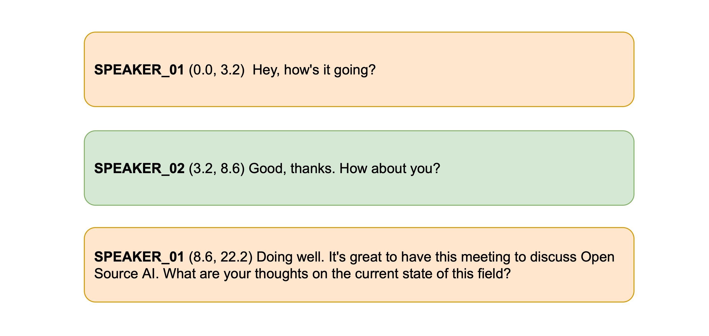

# 会议转录

在最后一节中，我们将使用 Whisper 模型为两个或两个以上说话者之间的对话或会议生成转录。然后，我们将把它与*说话者日志*模型配对，以预测"谁在什么时候说话"。通过将 Whisper 转录中的时间戳与说话者日志模型中的时间戳进行匹配，我们可以预测出端到端的会议转录，其中每个说话者的开始/结束时间都是完全格式化的。这就是您可能在网上看到的 [Otter.ai](https://otter.ai/) 等公司提供的会议转录服务的基本版本：



## 说话人日志

说话人日志的任务是获取无标签的音频输入，并预测"谁在什么时候说话"。在此过程中，我们可以预测每个发言人的开始/结束时间戳，对应于每个发言人开始发言和结束发言的时间。

目前，Hugging Face Transformers 库中并不包含说话人日志模型，但 Hub 上有一些检查点，可以比较容易地使用。在本例中，我们将使用来自 [pyannote.audio](https://github.com/pyannote/pyannote-audio) 的预训练扬声器日化模型。让我们开始安装库：

```shell
pip install --upgrade pyannote.audio
```

太好了！该模型的权重托管在 Hugging Face Hub 上。要访问这些权重，我们首先要同意说话人日志模型的使用条款：[pyannote/speaker-diarization]()https://huggingface.co/pyannote/speaker-diarization。然后是分割模型的使用条款：[p]yannote/segmentation](https://huggingface.co/pyannote/segmentation)。

完成后，我们就可以在本地设备上加载预训练的说话人日志流水线：

```python
from pyannote.audio import Pipeline

diarization_pipeline = Pipeline.from_pretrained(
    "pyannote/speaker-diarization@2.1", use_auth_token=True
)
```

让我们在一个样本音频文件上试试看！为此，我们将加载 [LibriSpeech ASR](https://huggingface.co/datasets/librispeech_asr) 数据集的一个样本，该数据集由两个不同的说话人组成，它们被连接在一起，形成一个音频文件：

```python
from datasets import load_dataset

concatenated_librispeech = load_dataset(
    "sanchit-gandhi/concatenated_librispeech", split="train", streaming=True
)
sample = next(iter(concatenated_librispeech))
```

我们可以听一听音频，看看它听起来像什么：

```python
from IPython.display import Audio

Audio(sample["audio"]["array"], rate=sample["audio"]["sampling_rate"])
```

酷！我们可以清楚地听到两个不同的说话人，在大约 15 秒的时间里有一个过渡。让我们把这个音频文件传递给日记化模型，以获得扬声器的开始/结束时间。请注意，pyannote.audio 希望音频输入是一个 PyTorch 张量形状 `(channels, seq_len)`，因此我们需要在运行模型之前进行转换：

```python
import torch

input_tensor = torch.from_numpy(sample["audio"]["array"][None, :]).float()
outputs = diarization_pipeline(
    {"waveform": input_tensor, "sample_rate": sample["audio"]["sampling_rate"]}
)

outputs.for_json()["content"]
```

```python
[{'segment': {'start': 0.4978125, 'end': 14.520937500000002},
  'track': 'B',
  'label': 'SPEAKER_01'},
 {'segment': {'start': 15.364687500000002, 'end': 21.3721875},
  'track': 'A',
  'label': 'SPEAKER_00'}]
```

这看起来相当不错！我们可以看到，第一位发言者在 14.5 秒之前一直在发言，而第二位发言者则从 15.4 秒开始发言。现在我们需要进行转录！

## 语音转录
在本单元中，我们将第三次在语音转录系统中使用 Whisper 模型。具体来说，我们将加载 [Whisper Base](https://huggingface.co/openai/whisper-base) 检查点，因为它足够小，可以提供良好的推理速度和合理的转录准确性。和以前一样，您可以随意使用 [Hub](https://huggingface.co/models?pipeline_tag=automatic-speech-recognition&library=transformers&sort=trending) 上的任何语音识别检查点，包括 Wav2Vec2、MMS ASR 或其他 Whisper 检查点：

```python
from transformers import pipeline

asr_pipeline = pipeline(
    "automatic-speech-recognition",
    model="openai/whisper-base",
)
```

让我们来获取样本音频的转录，同时返回片段级时间戳，这样我们就能知道每个片段的开始/结束时间。你应该还记得第五单元，我们需要传递参数 `return_timestamps=True` 来激活 Whisper 的时间戳预测任务：

```python
asr_pipeline(
    sample["audio"].copy(),
    generate_kwargs={"max_new_tokens": 256},
    return_timestamps=True,
)
```

```
{
    "text": " The second and importance is as follows. Sovereignty may be defined to be the right of making laws. In France, the king really exercises a portion of the sovereign power, since the laws have no weight. He was in a favored state of mind, owing to the blight his wife's action threatened to cast upon his entire future.",
    "chunks": [
        {"timestamp": (0.0, 3.56), "text": " The second and importance is as follows."},
        {
            "timestamp": (3.56, 7.84),
            "text": " Sovereignty may be defined to be the right of making laws.",
        },
        {
            "timestamp": (7.84, 13.88),
            "text": " In France, the king really exercises a portion of the sovereign power, since the laws have",
        },
        {"timestamp": (13.88, 15.48), "text": " no weight."},
        {
            "timestamp": (15.48, 19.44),
            "text": " He was in a favored state of mind, owing to the blight his wife's action threatened to",
        },
        {"timestamp": (19.44, 21.28), "text": " cast upon his entire future."},
    ],
}
```

好吧！我们可以看到，每段记录都有一个开始和结束时间，在 15.48 秒处说话人发生了变化。现在，我们可以将此转录与我们从说话人日志模型中获得的发言者时间戳配对，从而得到最终的转录。

## 语音框
为了得到最终的转录，我们将把说话人日志模型中的时间戳与 Whisper 模型中的时间戳对齐。日记化模型预测第一位发言者在 14.5 秒时结束，第二位发言者在 15.4 秒时开始，而 Whisper 预测的片段边界分别为 13.88 秒、15.48 秒和 19.44 秒。由于 Whisper 的时间戳与说话人日志模型的时间戳并不完全一致，因此我们需要找出其中哪个边界最接近 14.5 秒和 15.4 秒，并据此按发言人对转录进行分割。具体来说，我们将通过最小化日记时间戳和转录时间戳之间的绝对距离，找到两者之间最接近的吻合点。

幸运的是，我们可以使用 🤗 Speechbox 软件包来进行这种对齐。首先，让我们在main中用 pip 安装 `speechbox`：

```python
pip install git+https://github.com/huggingface/speechbox
```

现在，我们可以通过向 [ASRDiarizationPipeline](https://github.com/huggingface/speechbox/tree/main#asr-with-speaker-diarization) 类传递说话人日志模型和 ASR 模型，实例化我们的组合式 说话人日志加转录流水线：

```python
from speechbox import ASRDiarizationPipeline

pipeline = ASRDiarizationPipeline(
    asr_pipeline=asr_pipeline, diarization_pipeline=diarization_pipeline
)
```

> 您也可以通过指定 Hub 上 ASR 模型的模型 ID，直接从预处理实例化 `ASRDiarizationPipeline`：
> `pipeline = ASRDiarizationPipeline.from_pretrained("openai/whisper-base")`

让我们把音频文件传给合成流水线，看看会得到什么结果：

```python
pipeline(sample["audio"].copy())
```

```
[{'speaker': 'SPEAKER_01',
  'text': ' The second and importance is as follows. Sovereignty may be defined to be the right of making laws. In France, the king really exercises a portion of the sovereign power, since the laws have no weight.',
  'timestamp': (0.0, 15.48)},
 {'speaker': 'SPEAKER_00',
  'text': " He was in a favored state of mind, owing to the blight his wife's action threatened to cast upon his entire future.",
  'timestamp': (15.48, 21.28)}]
```

出色！第一位发言者的发言时间段为 0 至 15.48 秒，第二位发言者的发言时间段为 15.48 至 21.28 秒，并分别给出了相应的转录。

通过定义两个辅助函数，我们可以将时间戳格式化得更漂亮一些。第一个函数将时间戳元组转换为字符串，并四舍五入到设定的小数位数。第二个函数将发言人 ID、时间戳和文本信息合并到一行，并将每个发言人分割到各自的一行，以方便阅读：

```python
def tuple_to_string(start_end_tuple, ndigits=1):
    return str((round(start_end_tuple[0], ndigits), round(start_end_tuple[1], ndigits)))


def format_as_transcription(raw_segments):
    return "\n\n".join(
        [
            chunk["speaker"] + " " + tuple_to_string(chunk["timestamp"]) + chunk["text"]
            for chunk in raw_segments
        ]
    )
```

让我们重新运行流水线，这次根据我们刚刚定义的函数对转录进行格式化：

```python
outputs = pipeline(sample["audio"].copy())

format_as_transcription(outputs)
```

```
SPEAKER_01 (0.0, 15.5) The second and importance is as follows. Sovereignty may be defined to be the right of making laws.
In France, the king really exercises a portion of the sovereign power, since the laws have no weight.

SPEAKER_00 (15.5, 21.3) He was in a favored state of mind, owing to the blight his wife's action threatened to cast upon
his entire future.
```

就是这样！就这样，我们对输入音频进行了日记化和转录，并返回了说话者分段转录。虽然对齐日记化时间戳和转录时间戳的最小距离算法很简单，但在实践中效果很好。如果您想探索更先进的时间戳组合方法，可以从 `ASRDiarizationPipeline` 的源代码开始：[speechbox/diarize.py](https://github.com/huggingface/speechbox/blob/96d2d1a180252d92263f862a1cd25a48860f1aed/src/speechbox/diarize.py#L12)